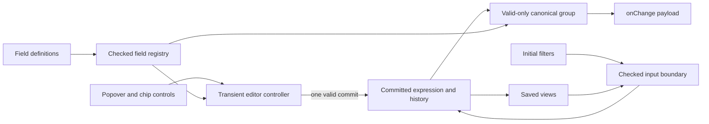

# Filter Component

A dependency-injected filter-token builder built with React 19 and Vite. The
parent supplies field definitions and receives the complete, valid filter group
after each committed change. The component does not fetch data or synchronize
URL state: applying filters remains the parent’s responsibility.

Conditions use **smart joiners**. Users flip the `and`/`or` words between
chips, `and` binds tighter than `or`, and the component derives grouping rather
than exposing group-management controls. The emitted payload is always
canonical, two-level disjunctive normal form.

## Public API

Import the component and its public types from the component entrypoint. Import
the component stylesheet once in the document or Shadow Root where the filter
will render.

```tsx
import {
  Filter,
  type FilterFieldDefinition,
  type FilterGroup,
} from '@/components/filter';
import '@/components/filter/filter-component.css';

const fields = [
  {
    key: 'stage',
    label: 'Stage',
    type: 'enum',
    operators: ['equals', 'in'],
    options: ['Lead', 'Negotiation', 'Closed won'],
  },
  {
    key: 'dealValue',
    label: 'Deal value',
    type: 'number',
  },
] as const satisfies readonly FilterFieldDefinition[];

const initialFilters: FilterGroup = {
  combinator: 'and',
  conditions: [
    {
      fieldKey: 'stage',
      type: 'enum',
      operator: 'equals',
      value: 'Lead',
    },
  ],
};

export function DealFilters() {
  return (
    <Filter
      fields={fields}
      initialFilters={initialFilters}
      onChange={(group, abortController) => {
        void fetch('/api/deals/search', {
          method: 'POST',
          body: JSON.stringify(group),
          signal: abortController.signal,
        });
      }}
    />
  );
}
```

`initialFilters` is read when the component mounts. It seeds the row silently
and does not create an undo entry or call `onChange`. If initial filters come
from an asynchronous source, load them in the parent before mounting `Filter`.

Each `onChange` call receives a fresh `AbortController`. A newer committed
change aborts the preceding controller, and unmounting aborts the final one.
Pass its signal to asynchronous work to make cancellation explicit.

Public conditions carry semantic filter data only—`fieldKey`, `type`,
`operator`, and the operator-specific `value`. Rendering identifiers are an
internal concern and never appear in initial, emitted, or persisted groups.

## State and data flow

The component separates transient editing from committed state. Think of the
editor as a scratchpad and history as the ledger: typing and moving through a
popover stage changes only the scratchpad; a successful commit writes one
ledger entry and emits one payload.



State ownership is intentionally narrow:

- **Editor controller:** Owns the active field/operator/value stage,
  incomplete drafts, validation errors, active choice, and semantic focus
  requests. Rendering components receive commands, not raw state setters.
- **History controller:** Owns the flat committed expression, undo/redo, and
  the `onChange`/cancellation boundary. Every command reduces exactly once.
- **Saved-views controller:** Owns the in-memory view list and persistence
  under `filter.saved-views`. Loading a view is an ordinary undoable replace.
- **Field registry:** Validates definitions and reconciles both committed
  conditions and an open editor when the parent changes the schema.

The committed `FilterExpression` is a flat sequence of conditions plus one
joiner per gap. At the emit boundary, `toFilterGroup` splits on `or` joiners;
single-condition runs stay bare and longer runs become `and` groups. Invalid
conditions remain visible so users can repair them, but are omitted from the
parent payload without mutating history.

The model deliberately represents an _or of and-runs_. It cannot faithfully
represent `A and (B or C)`, so saved views reject that shape. Foreign initial
trees are linearized in reading order rather than distributed. Feeding an
emitted group back through `initialFilters` always round-trips exactly.

## Validation and saved views

Runtime validation happens where data enters the component:

- Field definitions require nonblank unique keys, nonempty unique operator
  sets, and nonblank unique enum options.
- Initial groups and saved views use the same strict condition/group schema,
  including finite numbers, real `YYYY-MM-DD` dates, ordered ranges, nonempty
  enum selections, and valid durations.
- Intrinsically malformed `initialFilters` throw with the failing path because
  they are a programming error. A structurally valid condition that no longer
  matches the current field registry stays visible and flagged for repair.
- Saved-view storage is untrusted input. Each malformed view is dropped
  independently, while the documented legacy flat view shape still loads.

Saved views persist canonical groups without internal identifiers in
`localStorage` under `filter.saved-views`. A storage write failure keeps the
in-memory view available for the current session and announces that it was not
persisted.

## Source tour

- `src/components/filter/`: Public entrypoints, rendering components, editor
  and history controllers, and their component tests.
- `src/utilities/filter/`: Pure expression, validation, persistence, search,
  formatting, and value-draft logic. Start here when changing domain rules.
- `src/types/filter.ts`: The public semantic API. Internal history and editor
  types live beside the modules that own them.
- `src/example/`: The demo parent, fixture records, synchronous filter
  application, and example-only styling.
- `end-to-end/`: Browser-only keyboard, geometry, accessibility, integration,
  and visual-regression coverage.

When changing behavior, begin at the narrowest owner. Domain invariants belong
in pure utility tests, editor/history interactions in component tests, and
native Popover, focus geometry, Shadow DOM, and layout behavior in Playwright.

## Styling and integration

`src/components/filter/filter-component.css` is the single component
stylesheet entrypoint. It imports component styles in a deterministic order
and defines concrete defaults for the public `--filter-*` custom properties.
The example palette and page layout are not component prerequisites.

For ordinary light DOM, import the stylesheet next to the public component as
shown in the API example. A Chrome extension content script should use a
Shadow Root for isolation and install the stylesheet in that root rather than
injecting it into the page document. In this Vite project, the complete setup
is:

```tsx
import { createRoot } from 'react-dom/client';
import { Filter } from '@/components/filter';
import filterStylesheetUrl from '@/components/filter/filter-component.css?url';

const host = document.createElement('div');
document.documentElement.append(host);

const shadowRoot = host.attachShadow({ mode: 'open' });
const stylesheet = document.createElement('link');
stylesheet.rel = 'stylesheet';
stylesheet.href = filterStylesheetUrl;

const mountPoint = document.createElement('div');
shadowRoot.append(stylesheet, mountPoint);
createRoot(mountPoint).render(<Filter fields={fields} onChange={onChange} />);
```

The filter, its native `popover="auto"` element, and its invoking controls must
remain in the same document or Shadow Root. Popovers still enter the top layer
from a Shadow Root, and `showPopover({ source })` preserves the implicit anchor.
Extension popup, options-page, and side-panel surfaces own their document and
usually do not need Shadow DOM.

## Browser support

The component targets **Chrome 133 or newer** and relies on:

- The Popover API, including `showPopover({ source: anchorElement })`
- CSS Anchor Positioning (`anchor()` and `position-try-fallbacks`)
- Native CSS nesting, `oklch()`, and `color-mix()`

The Vite build targets `chrome133` for JavaScript and CSS. There are no legacy
outputs or polyfills. A consuming extension must declare:

```json
{
  "minimum_chrome_version": "133"
}
```

## Development and verification

- `bun run dev`: Start the Vite development server.
- `bun run test`: Run Vitest unit and component tests in jsdom.
- `bun run test:coverage`: Run the same suite with the required 100% line,
  branch, function, and statement coverage for executable production source.
- `bun run test:e2e`: Run Playwright behavior, accessibility, geometry, and
  visual-regression tests in Chromium.
- `bun run test:e2e:ui`: Open Playwright UI mode.
- `bun run test:e2e:update-snapshots`: Refresh intentional visual baselines;
  review every changed image before committing.
- `bun run lint:css`: Run Stylelint over component and example CSS.
- `bun run check:file-sizes`: Require every non-test TypeScript/TSX
  implementation file to remain at or below 500 lines.
- `bun run validate`: Run formatting, TypeScript/JavaScript linting, CSS
  linting, type-checking, file-size checks, 100% coverage, the complete
  Playwright suite, and the production build.

Vitest owns colocated `src/**/*.test.ts(x)` tests. Playwright owns
`end-to-end/*.spec.ts` and the committed baselines under
`end-to-end/visual.spec.ts-snapshots/`. GitHub Actions runs the same
`bun run validate` gate on macOS so its rendering environment matches those
Darwin snapshots.
