# Filter Component

> Building or changing the component? Start with the [architecture and contributor guide](documentation/README.md).

Filter builders have a habit of becoming small query languages with a user interface bolted on afterward. This component takes the opposite route: the parent injects a field schema, the user builds readable filter chips, and the component reports one complete semantic filter group after every committed change. Fetching, record matching, URL synchronization, and server syntax stay with the parent.

The component is built with [React 19](https://react.dev/) and [TypeScript](https://www.typescriptlang.org/). It targets [Chrome extensions](https://developer.chrome.com/docs/extensions/) and uses the browser's [Popover API](https://developer.mozilla.org/en-US/docs/Web/API/Popover_API) and [CSS Anchor Positioning](https://developer.mozilla.org/en-US/docs/Web/CSS/CSS_anchor_positioning) instead of a positioning library.

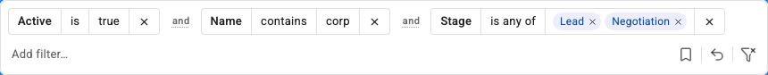

## Quick start

This repository is private and does not publish a package yet. Its public source entrypoint is `src/components/filter/index.ts`; the `@/` imports below use the alias already configured in this project.

Define the fields the parent is willing to filter, import the component stylesheet once, and handle the complete group in `onChange`:

```tsx
import {
  Filter,
  type FilterFieldDefinition,
  type FilterGroup,
} from '@/components/filter/index.ts';
import '@/components/filter/filter-component.css';

const fields = [
  { key: 'name', label: 'Name', type: 'string' },
  { key: 'dealValue', label: 'Deal value', type: 'number' },
  { key: 'active', label: 'Active', type: 'boolean' },
  {
    key: 'stage',
    label: 'Stage',
    type: 'enum',
    operators: ['equals', 'in'],
    options: ['Lead', 'Negotiation', 'Closed won'],
  },
  { key: 'closeDate', label: 'Close date', type: 'date' },
] as const satisfies readonly FilterFieldDefinition[];

const initialFilters: FilterGroup = {
  combinator: 'and',
  conditions: [
    {
      fieldKey: 'active',
      type: 'boolean',
      operator: 'equals',
      value: true,
    },
  ],
};

export function DealFilters() {
  return (
    <Filter
      aria-label="Deal filters"
      fields={fields}
      initialFilters={initialFilters}
      onChange={(filters, abortController) => {
        void fetch('/api/deals/search', {
          method: 'POST',
          headers: { 'content-type': 'application/json' },
          body: JSON.stringify(filters),
          signal: abortController.signal,
        });
      }}
    />
  );
}
```

`Filter` is intentionally uncontrolled. `initialFilters` is read once when the component mounts; it does not create an undo entry and does not call `onChange`. Apply that initial group in the parent as part of the parent's own initialization. If the seed arrives asynchronously, wait for it before mounting `Filter` or remount the component with a new React `key`.

Each real commit calls `onChange` with the entire valid group and a fresh [`AbortController`](https://developer.mozilla.org/en-US/docs/Web/API/AbortController). Before the next callback, the component aborts the previous controller. It also aborts the latest controller on unmount. Pass the signal to asynchronous work and you get latest-request cancellation without teaching the filter component anything about your data layer.

## Public component props

`FilterProps` extends native `<form>` props, with `children`, native `onChange`, and `onSubmit` reserved by the component.

| Prop                | Type                                                               | Behavior                                                                                                                                     |
| ------------------- | ------------------------------------------------------------------ | -------------------------------------------------------------------------------------------------------------------------------------------- |
| `fields`            | `readonly FilterFieldDefinition[]`                                 | Required injected field schema. Definitions are validated at runtime and copied into an internal registry.                                   |
| `onChange`          | `(filters: FilterGroup, abortController: AbortController) => void` | Receives the complete valid-only group after each committed edit. Optional.                                                                  |
| `initialFilters`    | `FilterGroup`                                                      | One-time mount seed. It is silent and not undoable. Recursive groups are accepted, then normalized into the component's joiner model.        |
| `disabled`          | `boolean`                                                          | Disables the whole fieldset, removes chip roots from the tab order, and closes any open editor. Defaults to `false`.                         |
| `savedViewsStorage` | `SavedViewsStorage`                                                | One-time persistence dependency. Defaults to browser [`localStorage`](https://developer.mozilla.org/en-US/docs/Web/API/Window/localStorage). |
| `aria-label`        | `string`                                                           | Names the form. Defaults to `Filters`.                                                                                                       |
| `className`         | `string`                                                           | Merged with the component's `filter` class. Use it for scoped token overrides.                                                               |
| Other form props    | Native form attributes and `ref`                                   | Spread onto the root `<form>`. Native submission is always prevented.                                                                        |

The complete public entrypoint exports three runtime values:

- `Filter`
- `createChromeSavedViewsStorage`
- `localSavedViewsStorage`

It also exports these types:

- `ChromeStorageArea`
- `SavedView`
- `SavedViewsStorage`
- `FilterCombinator`
- `FilterCondition`
- `FilterFieldDefinition`
- `FilterFieldType`
- `FilterGroup`
- `FilterList`
- `FilterOperator`
- `FilterOperatorsByFieldType`
- `FilterProps`
- `FilterScalarValue`
- `RangeValue`
- `WithinLastUnit`
- `WithinLastValue`

The [developer guide's public API section](documentation/README.md#the-public-api) walks through the exact discriminated unions and runtime validation rules.

## Defining fields

Every field needs a unique, trimmed `key` and one of the five supported `type` values. `label` is optional; the interface falls back to the key when it is absent. Enum fields must provide a nonempty, unique `options` list. Other field types must not provide one.

The optional `operators` list narrows the defaults for that field. It cannot add an operator from another type, must not contain duplicates, and controls the order shown in the menu. Field and enum-option order are also preserved. The component validates the complete schema at runtime, rejects extra properties, and throws a path-specific `TypeError` when the contract is malformed.

## The filter row

Each committed condition becomes a chip with independently editable field, operator, and value segments. Multi-select enum values render as removable pills inside the value segment. The right-side action rail appears only when it has something useful to offer: saved views, undo/redo, or clear-all.

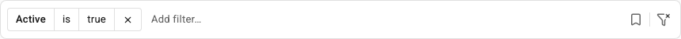

The add-filter input and action rail travel as one flex item. On a narrow row, they wrap together and the rail remains at the bottom-right instead of wandering into the middle of a chip sequence (a tiny layout choice that prevents a surprising amount of visual nonsense).

## Adding a filter

Creating a condition moves through field, operator, and value stages. The row shows a dashed preview as soon as the field is known, and the popover follows that preview while the draft grows.

### Choose a field

Type in the `Add filter` combobox to search by field label or key. Prefix matches come before contains matches, and both groups keep the order from `fields`. Focus alone does not open the menu; typing or pressing Arrow Up/Arrow Down does.

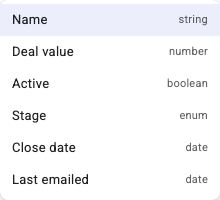

### Choose an operator

The operator menu is determined by the selected field type. A field can narrow its menu with `operators`; it cannot add an operator that the type does not support.

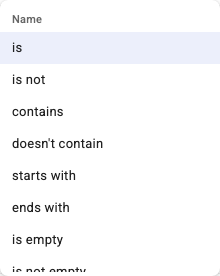

| Field type | Default operators                                                                                                             | Value shape                                                                  |
| ---------- | ----------------------------------------------------------------------------------------------------------------------------- | ---------------------------------------------------------------------------- |
| `string`   | `equals`, `notEquals`, `contains`, `notContains`, `startsWith`, `endsWith`, `isEmpty`, `isNotEmpty`                           | Nonblank string, or no value for empty checks                                |
| `number`   | `equals`, `notEquals`, `greaterThan`, `greaterThanOrEqual`, `lessThan`, `lessThanOrEqual`, `between`, `isEmpty`, `isNotEmpty` | Finite number or inclusive `{ from, to }` range                              |
| `boolean`  | `equals`, `isEmpty`, `isNotEmpty`                                                                                             | Boolean, or no value for empty checks                                        |
| `enum`     | `equals`, `notEquals`, `in`, `notIn`, `isEmpty`, `isNotEmpty`                                                                 | One listed string or a nonempty unique string array                          |
| `date`     | `on`, `notOn`, `before`, `onOrBefore`, `after`, `onOrAfter`, `between`, `withinLast`, `isEmpty`, `isNotEmpty`                 | Real `YYYY-MM-DD` date, inclusive date range, or `{ amount, unit }` duration |

The labels in the interface are deliberately human-readable: `greaterThan` is shown as “greater than,” `in` as “is any of,” and so on. The emitted payload keeps the stable operator identifier.

### Enter a value

The value editor follows the operator:

- Text, number, and date operators use one input.
- `between` uses `From` and `To` inputs and includes both endpoints.
- `withinLast` uses a positive whole-number amount and a `days`, `weeks`, or `months` unit.
- `equals` and `notEquals` on an enum use a single-choice list.
- `in` and `notIn` use a multi-select list. Space toggles the active option; Enter or the Apply button commits the whole selection.
- `isEmpty` and `isNotEmpty` commit immediately because there is no value to ask for.
- Boolean fields collapse operator and value into one list: true, false, empty, or not empty. Narrowing a boolean field's operators narrows that list too.

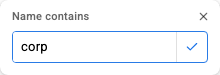

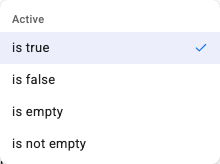

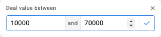

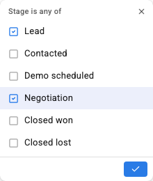

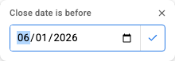

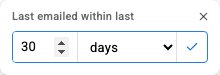

Invalid drafts stay in the editor and show a specific inline alert. Empty text, non-finite numbers, incomplete or inverted ranges, impossible calendar dates, empty enum selections, unknown enum options, and non-positive or fractional durations never reach history or `onChange`.

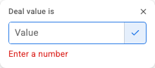

## Editing and removing filters

Click a chip's field, operator, or value to reopen only that segment. Editing does not move the chip. A compatible operator change reuses the existing value and may commit immediately; changing to a different editor shape carries over the useful part when that is unambiguous. For example, a scalar number becomes the `from` side of a number range, and one enum value becomes the first checked item in a multi-select.

Multi-select enum chips expose each selected option as a pill:

- Click a pill label to edit the whole selection.
- Remove one pill to update the condition in one undoable commit.
- Remove the final pill to remove the condition.

Click the final × on a chip to remove the whole condition. If mixed `and`/`or` joiners are present, the component removes the condition's adjacent leading joiner and derives the remaining grouping again.

Escape cancels an edit without changing the committed chip. Clicking away from an edit does the same thing. Existing-token edits are never turned into incomplete drafts.

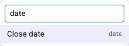

## How `and` and `or` work

There are no group handles, nesting menus, or draggable parentheses. The words between chips are the structure. Click a joiner—or focus it and press Enter or Space—to flip that one gap between `and` and `or`.

`and` binds tighter than `or`. So, this row:

```text
Active is true  and  Name contains corp  or  Deal value greater than 10000
```

means this:

```text
(Active is true and Name contains corp) or Deal value greater than 10000
```

The component adds read-only brackets around every multi-condition `and` run once an `or` appears:

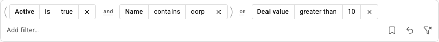

The matching payload is canonical two-level disjunctive normal form—an `or` of `and` runs:

```json
{
  "combinator": "or",
  "conditions": [
    {
      "combinator": "and",
      "conditions": [
        {
          "fieldKey": "active",
          "type": "boolean",
          "operator": "equals",
          "value": true
        },
        {
          "fieldKey": "name",
          "type": "string",
          "operator": "contains",
          "value": "corp"
        }
      ]
    },
    {
      "fieldKey": "dealValue",
      "type": "number",
      "operator": "greaterThan",
      "value": 10000
    }
  ]
}
```

An all-`and` row stays one flat `and` group. An all-`or` row becomes an `or` group with bare conditions. New conditions always append with `and`.

> [!WARNING]
>
> The row represents an _or of and-runs_. It cannot faithfully represent `A and (B or C)`. Saved views reject that shape. Recursive `initialFilters` are accepted, but a non-representable tree is linearized in reading order rather than algebraically distributed. Feed emitted canonical groups back into the component when exact round-tripping matters.

## Incomplete drafts

Clicking away while creating a new condition after choosing its field keeps the work as one resumable, dashed chip. Its operator and typed or selected value are preserved. Click the chip to continue or its × to discard it.

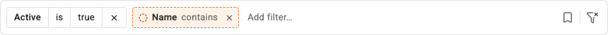

Incomplete drafts are scratch work:

- They are never included in `onChange`.
- They do not create history entries.
- Only a new condition can become incomplete; an abandoned edit reverts to the existing committed chip.
- Escape means _cancel_ and discards the open draft. Browser light dismissal means _keep this for later_ and creates the incomplete chip.
- Only one incomplete draft is retained. Abandoning a newer composition replaces the older one.
- Disabling the component preserves a new open draft and closes its popover.

## Invalid committed filters

An incomplete filter has not committed yet. An invalid filter _was_ committed, but the current field definitions no longer agree with it. That distinction keeps live schema changes repairable instead of quietly deleting user intent.

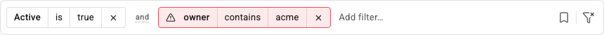

The component detects:

- Removed fields
- Field type changes
- Operators removed from a field's allowed set
- Enum options removed from the field

An invalid chip stays visible, is marked with its reason, remains in history, and can be saved in a view. It is excluded from the valid-only `onChange` payload. Activate its warning control to reopen the first broken segment and repair it. If a field-schema change alters the valid emitted group, the component reports the new group even though history itself did not change.

Intrinsically malformed `initialFilters` do not render as repairable chips. The public group parser throws a `TypeError` with the failing path because a malformed prop is a programming error. A structurally valid condition that merely disagrees with the injected fields is the repairable case.

## Undo, redo, and clear

History records semantic commits, not every keystroke. One history entry is created for each:

- Added condition
- Changed field, operator, or value
- Removed enum pill or condition
- Flipped joiner
- Clear-all action
- Loaded saved view

Typing, moving through a menu, validation failures, incomplete drafts, saving or removing a view, and the initial seed do not create entries. A no-op selection does not create one either.

Undo and redo buttons appear only when their action is available. Loading a view and clearing all filters are ordinary undoable changes. A new commit after undo clears the redo branch; there is one linear history rather than a tiny Git graph hiding in the filter bar. The component does not register global Command-Z or Control-Z shortcuts.

## Saved views

Saved views name and persist the complete row. The bookmark button appears when the current nonempty group can be saved or when at least one view already exists.

Open the menu and choose `Save current filters…`. Names are trimmed and must be nonblank. Saving under an existing name replaces that view in place. The save action disappears when the current group already matches any saved view.

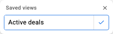

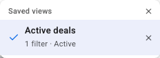

Each row shows its name and a compact summary. The active view has a check and `aria-current`. Loading a different view replaces the whole filter row, emits the loaded group, assigns fresh internal rendering identifiers, and creates one undo entry. Loading the already-active view is a no-op. Removing a view does not change the current filters.

By default, views persist in [`localStorage`](https://developer.mozilla.org/en-US/docs/Web/API/Window/localStorage) under `filter.saved-views`. Stored data is untrusted: the component validates each `{ name, group }` entry independently, keeps the first unique name, and drops malformed or unrepresentable entries. A failed read behaves like an empty store. A failed write keeps the optimistic view for the current session and shows a visible session-only notice.

### Chrome extension storage

Use the included adapter with any Promise-based [`chrome.storage`](https://developer.chrome.com/docs/extensions/reference/api/storage) area:

```tsx
import {
  createChromeSavedViewsStorage,
  Filter,
} from '@/components/filter/index.ts';

const savedViewsStorage = createChromeSavedViewsStorage(chrome.storage.local);

export function DealFilters() {
  return <Filter fields={fields} savedViewsStorage={savedViewsStorage} />;
}
```

The extension manifest needs the `storage` permission. `local`, `sync`, and `session` all satisfy the adapter's small `get`/`set` contract.

### Custom storage

The storage boundary accepts synchronous or asynchronous writes. Reads may also return a Promise because their return value is deliberately treated as unknown until runtime validation. The adapter is captured once on mount, and queued asynchronous writes are serialized so older whole-collection writes cannot land after newer ones.

```tsx
import { Filter, type SavedViewsStorage } from '@/components/filter/index.ts';

const savedViewsStorage: SavedViewsStorage = {
  async getSavedViews() {
    const response = await fetch('/api/saved-views');
    if (!response.ok) throw new Error('Could not load saved views');
    return response.json();
  },
  async saveSavedViews(savedViews) {
    const response = await fetch('/api/saved-views', {
      method: 'PUT',
      headers: { 'content-type': 'application/json' },
      body: JSON.stringify(savedViews),
    });
    if (!response.ok) throw new Error('Could not save saved views');
  },
};

export function DealFilters() {
  return <Filter fields={fields} savedViewsStorage={savedViewsStorage} />;
}
```

## Keyboard reference

The component follows composite-widget patterns from the [WAI-ARIA Authoring Practices Guide](https://www.w3.org/WAI/ARIA/apg/). Tokens are normal Tab stops; their internal controls and the joiners between tokens are reached with arrow keys. This keeps the main Tab order short without making the chip internals mouse-only.

### Add-filter input

| Key                    | Result                                                                                                               |
| ---------------------- | -------------------------------------------------------------------------------------------------------------------- |
| Type text              | Opens the field menu and filters by label or key.                                                                    |
| Arrow Down / Arrow Up  | Opens the menu when closed; moves through results with wraparound when open.                                         |
| Enter                  | Chooses the active field.                                                                                            |
| Tab                    | With a nonempty query, accepts the active suggestion. Otherwise closes the menu and continues normal focus movement. |
| Escape                 | Clears a nonempty query first. Press again with an empty query to close the menu.                                    |
| Backspace / Arrow Left | At caret position zero, moves to the final token when one exists.                                                    |

### Token roots and segments

| Key                                        | Result                                                                                        |
| ------------------------------------------ | --------------------------------------------------------------------------------------------- |
| Tab / Shift-Tab on a token root            | Moves through token roots in document order, then to the add-filter input and action buttons. |
| Enter / Space / Arrow Down on a token root | Enters the chip at its first control.                                                         |
| Arrow Left / Arrow Right on a token root   | Moves through the visual sequence `token → joiner → token → add input`.                       |
| Tab / Shift-Tab inside a token             | Walks the chip's field, operator, value or enum-pill, warning, and remove controls.           |
| Arrow Left / Arrow Right inside a token    | Walks the same internal controls; moving past the end continues to the next joiner or token.  |
| Enter / Space on an editable segment       | Opens that segment.                                                                           |
| Arrow Down on an editable segment          | Opens that segment without activating destructive controls.                                   |
| Escape / Arrow Up inside a token           | Returns to the token root.                                                                    |
| Delete / Backspace on a segment            | First returns to the token root. A second press removes the whole token.                      |
| Delete / Backspace on a token root         | Removes the token immediately and focuses a sensible neighbor.                                |

### Joiners and popovers

| Context                                       | Keys                     | Result                                                                            |
| --------------------------------------------- | ------------------------ | --------------------------------------------------------------------------------- |
| Joiner                                        | Arrow Left / Arrow Right | Moves to the neighboring token.                                                   |
| Joiner                                        | Enter / Space            | Flips `and` ↔ `or`, keeps focus on the joiner, and announces the grouping change. |
| Single-choice list                            | Arrow Up / Arrow Down    | Moves with wraparound.                                                            |
| Single-choice list                            | Enter / Space            | Selects the active option.                                                        |
| Multi-select list                             | Arrow Up / Arrow Down    | Moves with wraparound.                                                            |
| Multi-select list                             | Space                    | Toggles the active enum option.                                                   |
| Multi-select list                             | Enter                    | Applies the complete selection.                                                   |
| Text, number, date, range, or duration editor | Enter                    | Validates and applies the draft.                                                  |
| Any filter popover                            | Escape                   | Cancels the editor and restores focus to its semantic anchor.                     |

### Saved views

| Key                           | Result                                                     |
| ----------------------------- | ---------------------------------------------------------- |
| Arrow Down on trigger         | Opens on the first saved view.                             |
| Arrow Up on trigger           | Opens on the last saved view.                              |
| Arrow Down / Arrow Up in list | Moves between views with wraparound.                       |
| Home / End                    | Moves to the first or last view.                           |
| Arrow Right                   | Moves from a view's load button to its remove button.      |
| Arrow Left                    | Returns from remove to load.                               |
| Delete / Backspace            | Removes the focused view and focuses its neighbor.         |
| Enter on a view               | Loads it and closes the menu.                              |
| Enter in the name field       | Validates and saves the name.                              |
| Escape                        | Closes the menu and returns focus to the bookmark trigger. |

## Accessibility and disabled state

The component exposes the row as a named form, committed conditions as a named list, each chip as a group named with its complete filter phrase, and menus as combobox/listbox or dialog structures. `aria-activedescendant` keeps focus stable while field and choice menus move their active option.

Committed changes, grouping changes, incomplete-draft preservation, and saved view actions are announced through a polite live region. Validation errors use `role="alert"` and are connected to their input with `aria-describedby`. Invalid chips include the reason in their accessible name and expose a specifically named repair button.

`disabled` uses a native `<fieldset disabled>` so every real control becomes inert together. The component also removes non-native chip roots from the tab order and ignores keyboard commands on a chip that happened to retain focus during the state change. A new open composition is preserved as incomplete; an existing-token edit closes without changing the token.

The browser suite runs [axe-core](https://github.com/dequelabs/axe-core) with all rules enabled against the idle row, field picker, scalar value editor, enum multi-select, enum pills, save flow, saved-view menu, mixed grouping, and invalid state. It separately verifies the alert and `aria-describedby` wiring for validation errors.

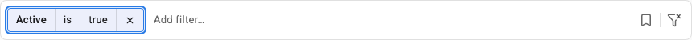

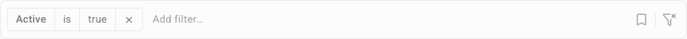

## Theming

Import `filter-component.css`; it is the only component stylesheet entrypoint. Color roles use public `--filter-color-*` custom properties. Set them on the `Filter` itself or any ancestor and ordinary CSS inheritance does the rest:

```tsx
<Filter className="deal-filter-theme" fields={fields} />
```

```css
.deal-filter-theme {
  --filter-color-background-primary: oklch(20% 0.02 260deg);
  --filter-color-text-primary: oklch(96% 0.01 260deg);
  --filter-color-background-action: oklch(70% 0.16 250deg);
  --filter-color-border-focus: oklch(80% 0.13 250deg);
}
```

Semantic tokens fall back to the shared palette in `src/styles/colors.css`, then to literal values so the component remains self-contained inside a Shadow Root. Only `--filter-color-*` is the stable public theming contract. The source also defines sizing, radius, focus-ring, and shadow variables on `.filter`. A source-level integration can override them with a selector at least as specific as `.filter`, but those names remain coupled to the current component CSS:

```css
.deal-filter-theme.filter {
  --filter-control-height: 32px;
  --filter-radius-control: 6px;
  --filter-radius-container: 10px;
}
```

The [complete token reference](documentation/README.md#design-tokens-and-css) lists every public color role, fallback, and override rule.

## Chrome extension integration

The build targets [Chrome 133](https://developer.chrome.com/release-notes/133) or newer. It relies on `showPopover({ source })`, CSS anchor positioning, native CSS nesting, `oklch()`, and `color-mix()` with no polyfills or legacy output. A consuming extension should declare:

```json
{
  "minimum_chrome_version": "133"
}
```

For an extension popup, options page, or side panel, import the stylesheet into that document normally. For a content script, use [Shadow DOM](https://developer.mozilla.org/en-US/docs/Web/API/Web_components/Using_shadow_DOM) to isolate the host page's CSS and install the stylesheet inside the same Shadow Root as the component. The filter, its native popovers, and their invoking controls must share a document or Shadow Root.

The full [Vite](https://vite.dev/) `?url` setup is in the [developer integration guide](documentation/README.md#light-dom-shadow-dom-and-chrome).

## Working on the component

The short version uses [Bun](https://bun.sh/):

```bash
bun install
bun run dev
bun run validate
```

[`bun run validate`](documentation/README.md#the-validation-pipeline) runs formatting, type-aware linting, CSS linting, TypeScript checks, the file-size guard, strict [React Compiler](https://react.dev/learn/react-compiler) validation, compiler-mode tests, unit/component tests, the complete Playwright suite, and the production build.

Read [the architecture and contributor guide](documentation/README.md) before changing behavior. The component stays understandable because each rule has one owner; the fastest way to make it mysterious again is to put a second copy of a domain rule in whichever component happened to be open in your editor.
