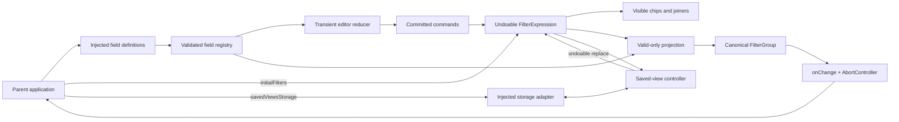
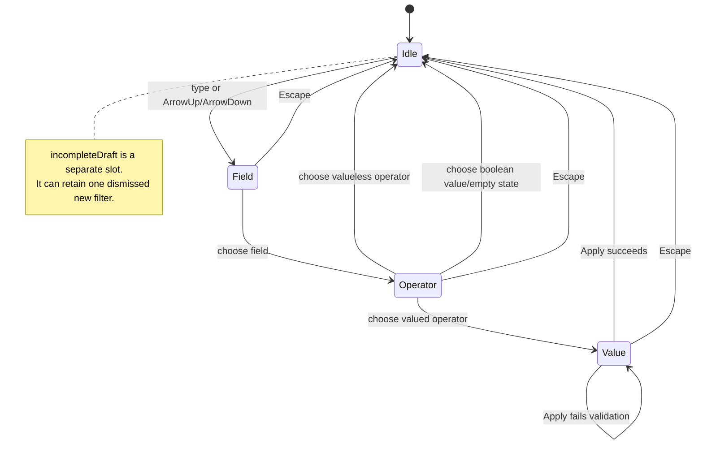
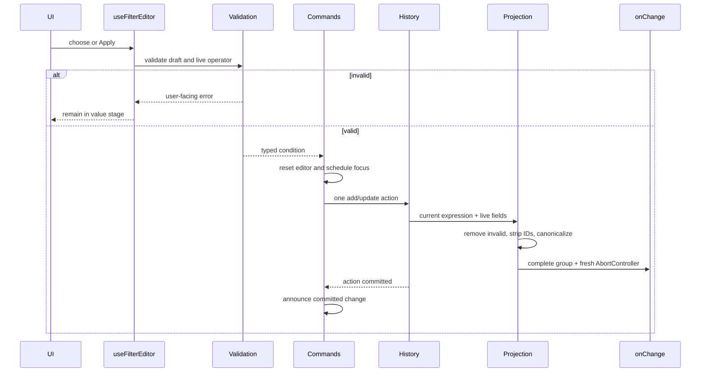
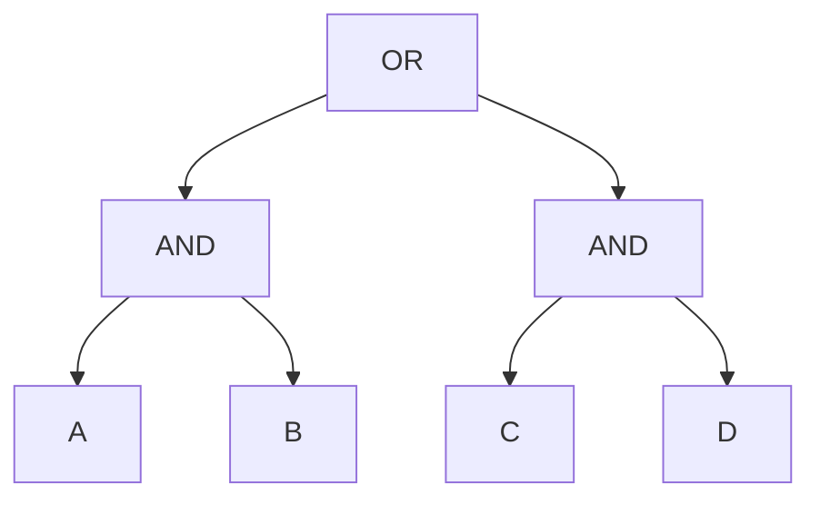
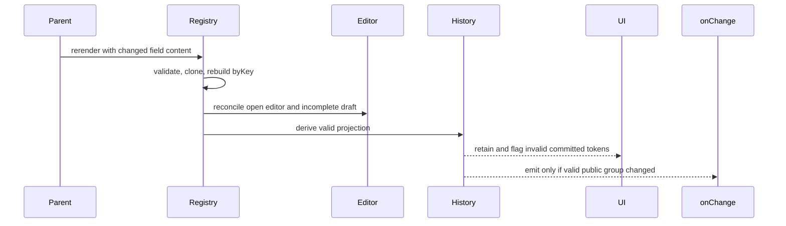
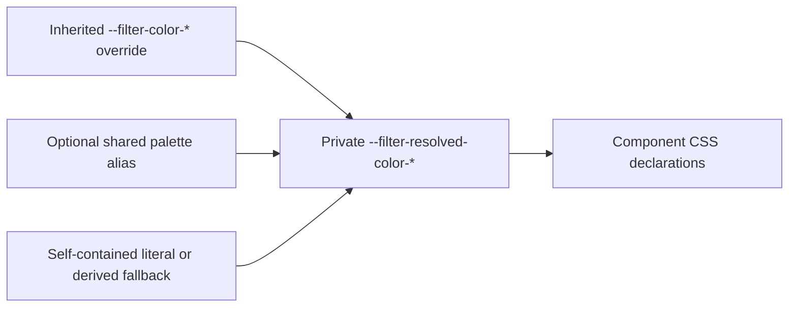
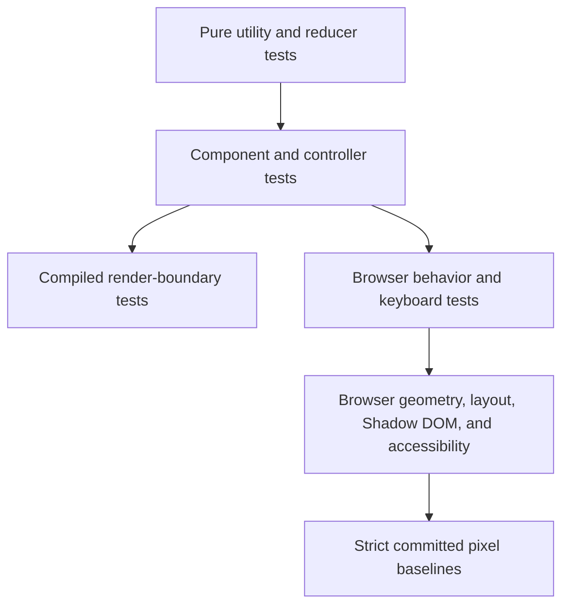

# Filter Component Architecture

> Looking for the consumer manual? Start with the project [README](../README.md).

A filter row looks like a handful of chips and a text box. Underneath, it has to coordinate a schema, a multi-stage editor, undoable committed state, asynchronous persistence, browser focus, and a public query tree without letting those concerns smear into one very clever hook. The code stays approachable by giving each concern one owner and passing narrow dependencies between them.

This guide is the map for working on the component. It covers the public API, the state machines, dependency injection, canonical `and`/`or` semantics, runtime validation, focus and popover behavior, design tokens, the example application, and every layer of the test pipeline.

## Contents

- [Architecture at a glance](#architecture-at-a-glance)
- [Dependency injection](#dependency-injection)
- [The public API](#the-public-api)
- [Field definitions and runtime validation](#field-definitions-and-runtime-validation)
- [The composition root](#the-composition-root)
- [Transient editor state](#transient-editor-state)
- [Committed state and history](#committed-state-and-history)
- [Canonical `and`/`or` groups](#canonical-andor-groups)
- [Incomplete and invalid states](#incomplete-and-invalid-states)
- [Live schema reconciliation](#live-schema-reconciliation)
- [Saved views](#saved-views)
- [Focus, popovers, and accessibility](#focus-popovers-and-accessibility)
- [Rendering boundaries and React Compiler](#rendering-boundaries-and-react-compiler)
- [Design tokens and CSS](#design-tokens-and-css)
- [Light DOM, Shadow DOM, and Chrome](#light-dom-shadow-dom-and-chrome)
- [The example application](#the-example-application)
- [Testing architecture](#testing-architecture)
- [The validation pipeline](#the-validation-pipeline)
- [Source map](#source-map)
- [Where changes belong](#where-changes-belong)

## Architecture at a glance

The easiest mental model is four layers plus one projection:

- **Injected schema:** The parent describes the fields users may filter.
- **Transient editor:** The user moves through field, operator, and value stages. This layer may hold one resumable incomplete draft.
- **Committed history:** Successful edits become a flat expression with undo and redo.
- **Persistence:** Saved views snapshot and restore whole public groups through an injected storage boundary.
- **Public projection:** The component removes schema-invalid conditions, canonicalizes grouping, strips internal identifiers, and calls the parent.



The split matters because the same condition can be in three different states:

- It can be a transient draft that should not reach the parent.
- It can be committed and valid, so it should render and emit.
- It can be committed but invalid against a newer schema, so it should render for repair but stay out of the executable payload.

Trying to represent all three with one `filters` array is where the usual relay race begins: one click updates local state, another effect normalizes it, a third effect calls the parent, and undo quietly records the intermediate state nobody meant to keep. This code does not play that game.

## Dependency injection

The component uses ordinary prop and function injection—there is no service container, context registry, or plugin framework. The public seams are narrow on purpose.

### Field schema injection

`fields` injects the domain vocabulary:

- Stable field keys
- Display labels
- Field types
- Optional per-field operator subsets and menu order
- Enum options and their order

The component knows how to edit the supported primitive field families, but it does not know what “Stage,” “Deal value,” or “Last emailed” mean to the product. That knowledge belongs to the parent.

### Execution injection

`onChange` injects what the application does with a completed filter group. The component never fetches records, writes a URL, compiles SQL, or decides how `withinLast` maps to a backend query. It reports semantic data and a cancellation controller. The parent owns execution.

That separation is why the same component can drive an in-memory demonstration, a REST request, a [GraphQL](https://graphql.org/) variable, a local extension index, or anything else that can consume `FilterGroup`.

### Persistence injection

`savedViewsStorage` injects two operations:

```ts
type SavedViewsStorage = {
  getSavedViews: () => unknown;
  saveSavedViews: (savedViews: readonly SavedView[]) => void | Promise<void>;
};
```

The reader returns `unknown` because every persistence system is an untrusted runtime boundary. The component parses the result rather than asking adapters to pretend their JSON is already trustworthy.

The default adapter uses [`localStorage`](https://developer.mozilla.org/en-US/docs/Web/API/Window/localStorage); the Chrome adapter wraps [`chrome.storage`](https://developer.chrome.com/docs/extensions/reference/api/storage); a consumer can inject an API, [IndexedDB](https://developer.mozilla.org/en-US/docs/Web/API/IndexedDB_API) facade, or in-memory test store without changing editor code.

### Internal function injection

The same idea continues inside the component:

- `createFilterEditorCommittedCommands` receives current-registry and current-history getters, history dispatch, identifier creation, focus, and announcement functions.
- `useFilterEditor` receives the registry, history boundary, focus boundary, announcement boundary, and popover anchor ref.
- `useSavedViews` receives history replacement, identifier creation, editor reset, focus, announcements, and the storage adapter.
- `useNativePopover` receives anchor resolution and semantic dismissal handlers.
- Rendering components receive state plus commands. They do not receive raw state setters.

These are narrow dependency boundaries, not abstractions for their own sake. They make reducer semantics and command behavior testable without rendering the entire component.

### Styling injection

Inherited CSS custom properties form a fourth public seam. Consumers supply semantic color roles such as `--filter-color-text-primary`; component rules use private resolved variables. The visual system remains configurable without a JavaScript theme provider.

### Deliberate limits

Consumers cannot inject custom operators, custom value editors, render slots, formatters, or predicate functions. Those are source-level changes today. This keeps the first version honest: flexibility exists where a real consumer contract already exists, not everywhere someone can imagine a future extension point.

## The public API

The repository is private and has no `exports`, `main`, or library-build entry. The public _source_ entrypoint is [`src/components/filter/index.ts`](../src/components/filter/index.ts). The project's `@/` alias is configured in both [`tsconfig.app.json`](../tsconfig.app.json) and its [Vite](https://vite.dev/) configuration in [`vite.config.ts`](../vite.config.ts); it is not an npm package name.

Import the component and types from that entrypoint, then import the component stylesheet separately:

```tsx
import {
  Filter,
  type FilterFieldDefinition,
  type FilterGroup,
} from '@/components/filter/index.ts';

import '@/components/filter/styles/filter-component.css';
```

### Runtime exports

| Export                          | Purpose                                                                          |
| ------------------------------- | -------------------------------------------------------------------------------- |
| `Filter`                        | The [React](https://react.dev/) form component.                                  |
| `createChromeSavedViewsStorage` | Adapts the Promise-based subset of `chrome.storage.local`, `sync`, or `session`. |
| `localSavedViewsStorage`        | The default `window.localStorage` adapter.                                       |

### Type exports

| Export                       | Purpose                                                                           |
| ---------------------------- | --------------------------------------------------------------------------------- |
| `FilterProps`                | Native form props plus the filter-specific injected contracts.                    |
| `FilterFieldDefinition`      | Discriminated union for injected field definitions.                               |
| `FilterFieldType`            | `'string'                                                                         | 'number' | 'boolean'  | 'enum' | 'date'`. |
| `FilterOperatorsByFieldType` | Type-level source of truth for every allowed operator.                            |
| `FilterOperator`             | Union of all operator identifiers.                                                |
| `FilterCondition`            | Operator-aware condition union; narrowing the type or operator narrows the value. |
| `FilterGroup`                | Recursive public group input and canonical output container.                      |
| `FilterCombinator`           | `'and'                                                                            | 'or'`.   |
| `FilterList`                 | `readonly FilterCondition[]`; exported for consumers that need a flat leaf list.  |
| `FilterScalarValue`          | Conditional scalar type: number, boolean, or string.                              |
| `RangeValue`                 | Inclusive `{ from, to }` range.                                                   |
| `WithinLastValue`            | `{ amount, unit }` for relative date conditions.                                  |
| `WithinLastUnit`             | `'days'                                                                           | 'weeks'  | 'months'`. |
| `SavedView`                  | Validated `{ name, group }` persistence shape.                                    |
| `SavedViewsStorage`          | Two-method persistence boundary.                                                  |
| `ChromeStorageArea`          | Structural Promise-based `get`/`set` contract used by the Chrome adapter.         |

### `FilterProps`

[`FilterProps`](../src/types/filter.ts) starts with `ComponentPropsWithRef<'form'>`, then removes `children`, native `onChange`, and native `onSubmit`.

| Prop                           | Contract                                                                                                   |
| ------------------------------ | ---------------------------------------------------------------------------------------------------------- |
| `fields`                       | Required immutable `readonly FilterFieldDefinition[]` snapshot; replace the array when definitions change. |
| `onChange`                     | Optional `(filters, abortController) => void`. The return value is ignored.                                |
| `onSubmit`                     | Optional `(filters: FilterGroup) => void`. Domain-level callback, not the native `SubmitEvent` handler.    |
| `disabled`                     | Optional boolean; defaults to `false`.                                                                     |
| `initialFilters`               | Optional one-time `FilterGroup` seed.                                                                      |
| `savedViewsStorage`            | Optional mount-captured persistence adapter; defaults to local storage.                                    |
| `aria-label`                   | Native form attribute; defaults to `Filters`.                                                              |
| `className`                    | Merged with the mandatory `filter` class.                                                                  |
| Remaining form props and `ref` | Forwarded to the root `<form>`.                                                                            |

The root always prevents native submit. A consumer cannot supply `children`, a native form `onChange`, or the native `onSubmit` because those would conflict with the component's controlled DOM structure and semantic callbacks.

### Submission

The root `<form>`'s `onSubmit` handler calls `event.preventDefault()`, then derives the valid-only `FilterGroup` from the current committed expression and the current field registry via `useFilterHistory`'s `getCurrentValidGroup()` — the same projection `onChange` uses, read fresh instead of from a render closure. It invokes the `onSubmit` prop with that group, and does not touch history or call `onChange`. Because the root is a real `<form>`, an external control using the standard HTML `form` attribute (e.g. `<button type="submit" form="...">`) triggers submission without any imperative API on the component.

The root also carries `noValidate`. Value editors render native inputs with their own constraints (e.g. the `withinLast` duration's `min={1}`); without `noValidate`, an external submit control could be blocked by the browser's own constraint validation on an open, uncommitted draft before this component's handler ever runs — invalid or incomplete drafts are already excluded from the emitted group by `getCurrentValidGroup()`, so native validation would only duplicate that exclusion while silently swallowing the submit.

### Uncontrolled initialization

`initialFilters` is read inside the history state initializer:

- It is parsed before use.
- It receives fresh internal identifiers.
- It seeds `history.present` with empty `past` and `future` arrays.
- It does not call `onChange`.
- It does not create an undo entry.
- Later prop changes are ignored.

If initial data arrives later, the parent should wait before mounting or remount with a new React `key`. There is no controlled `value` prop and no imperative replace method.

### Change notification and cancellation

Every real committed history action:

1. Reduces against the synchronously current history.
2. Stores the next history in a ref before scheduling React state.
3. Derives the valid public projection.
4. Aborts the previous controller.
5. Creates a new controller.
6. Calls the latest `onChange` callback.

A field-schema change may also call `onChange` when it changes the valid public projection. That re-projection does not create a history entry.

The hook retains the latest callback through a ref, so changing `onChange` does not rebuild committed state. Unmounting aborts the most recent controller.

### `FilterGroup`

The public tree is recursive on input:

```ts
type FilterGroup = {
  combinator: 'and' | 'or';
  conditions: readonly (FilterCondition | FilterGroup)[];
};
```

Output is more constrained. It is always one of:

- A flat `and` root, including the empty group
- An `or` root whose members are bare conditions or multi-condition `and` groups

No internal rendering identifier appears in `initialFilters`, emitted groups, or saved views.

### Runtime dependencies

The production dependency set is deliberately small:

- [React](https://react.dev/) owns rendering, hooks, refs, and reducer state.
- [clsx](https://github.com/lukeed/clsx) assembles conditional class names.
- [Lucide React](https://lucide.dev/guide/packages/lucide-react) supplies the interface icons.
- [Zod](https://zod.dev/) validates public groups, field definitions, and saved persistence data at runtime.
- [React DOM](https://react.dev/reference/react-dom/client/createRoot) mounts the example application; the component itself does not reach into a global root.

## Field definitions and runtime validation

The [TypeScript](https://www.typescriptlang.org/) model catches incorrect operator/value pairings at compile time. [Zod](https://zod.dev/) schemas enforce the same boundaries at runtime because props, storage, JSON, and live schema changes can still hand the component something TypeScript never saw.

### Field definition rules

`createFilterFieldRegistry` validates the full injected array:

- `key` must be nonblank, already trimmed, and unique across fields.
- `label` is optional. When present, it must be nonblank and already trimmed.
- `operators` is optional. When present, it must contain at least one unique operator valid for the field type. Its order becomes menu order.
- `options` is required for enum fields and forbidden for other field types.
- Enum options must be nonblank, already trimmed, unique, and nonempty as a list.
- Definition objects are strict; extra properties are rejected.

If validation fails, registry creation throws a `TypeError` with Zod's formatted paths. After validation, the registry:

- Clones the definitions with `structuredClone`.
- Builds a `Map` keyed by `field.key`.
- Stores a stable content signature.

The component treats `fields` as an immutable schema snapshot. A parent must provide a new array when any definition changes. The clone prevents later caller mutation from changing an existing registry behind its back, while the content signature lets editor and history state reconcile only when the replacement schema has meaningfully changed. Object keys are serialized in sorted order, while array order remains significant because field, operator, and enum menu order are product behavior.

### Operators and values

[`FilterOperatorsByFieldType`](../src/types/filter.ts) is the type-level source of truth. [`OPERATORS_BY_TYPE`](../src/utilities/filter/operators.ts) is the ordered runtime menu. A compile-time equality check fails if either gains or loses an operator without the other.

| Type      | Operators                                                                                 | Runtime value                                                                                          |
| --------- | ----------------------------------------------------------------------------------------- | ------------------------------------------------------------------------------------------------------ |
| `string`  | `equals`, `notEquals`, `contains`, `notContains`, `startsWith`, `endsWith`                | Nonblank string                                                                                        |
| `string`  | `isEmpty`, `isNotEmpty`                                                                   | No `value` property                                                                                    |
| `number`  | `equals`, `notEquals`, `greaterThan`, `greaterThanOrEqual`, `lessThan`, `lessThanOrEqual` | Finite number                                                                                          |
| `number`  | `between`                                                                                 | Strict `{ from, to }` with finite numbers and `from <= to`                                             |
| `number`  | `isEmpty`, `isNotEmpty`                                                                   | No `value` property                                                                                    |
| `boolean` | `equals`                                                                                  | Boolean                                                                                                |
| `boolean` | `isEmpty`, `isNotEmpty`                                                                   | No `value` property                                                                                    |
| `enum`    | `equals`, `notEquals`                                                                     | Nonblank string that exists in the live field options                                                  |
| `enum`    | `in`, `notIn`                                                                             | Nonempty unique string array; every member exists in the live options                                  |
| `enum`    | `isEmpty`, `isNotEmpty`                                                                   | No `value` property                                                                                    |
| `date`    | `on`, `notOn`, `before`, `onOrBefore`, `after`, `onOrAfter`                               | Real calendar date in `YYYY-MM-DD` form                                                                |
| `date`    | `between`                                                                                 | Strict ordered `{ from, to }` date range                                                               |
| `date`    | `withinLast`                                                                              | Strict `{ amount, unit }`, where amount is a positive integer and unit is `days`, `weeks`, or `months` |
| `date`    | `isEmpty`, `isNotEmpty`                                                                   | No `value` property                                                                                    |

The schemas are strict. A valueless operator must omit `value`; arbitrary extra keys and internal IDs are rejected. External nonblank string values may retain leading or trailing whitespace, while the component's own text editor trims before committing.

### Value editor kinds

`getValueEditorKind` turns a field/operator pair into one presentation shape:

| Kind          | Used for                                                    |
| ------------- | ----------------------------------------------------------- |
| `none`        | `isEmpty`, `isNotEmpty`                                     |
| `text`        | Valued string operators                                     |
| `number`      | Scalar number comparisons                                   |
| `numberRange` | Number `between`                                            |
| `boolean`     | Boolean equality; UI collapses this with operator selection |
| `enumSingle`  | Enum `equals`, `notEquals`                                  |
| `enumMulti`   | Enum `in`, `notIn`                                          |
| `date`        | Scalar date comparisons                                     |
| `dateRange`   | Date `between`                                              |
| `duration`    | Date `withinLast`                                           |

The mapping lives beside operator definitions so the editor does not rediscover field semantics in rendering code.

### Draft validation versus committed validation

There are two related boundaries:

- `validateDraft` turns text-shaped editor drafts into typed public values and returns a user-facing error instead of throwing.
- `createFilterCondition` and `filterConditionSchema` verify the complete dynamic field/operator/value combination before history accepts it.

Committed conditions are later checked against the _live_ registry by `getFilterValidationIssue`. That check catches schema drift rather than malformed editor input: missing fields, changed types, removed operators, and removed enum options.

## The composition root

[`filter.tsx`](../src/components/filter/filter.tsx) wires the system together. This is the **composition root**: the one module where concrete dependencies are assembled and passed to narrower state owners and rendering components.

The `Filter` component:

- Applies defaults for `disabled`, storage, and `aria-label`.
- Creates a React `useId` prefix and monotonic condition identifiers.
- Builds the validated field registry.
- Creates committed history.
- Creates the live-region state.
- Owns refs for the fieldset, add input, and current popover invoker.
- Creates semantic focus helpers.
- Creates the transient editor controller.
- Creates the saved-view controller.
- Derives presentation-only field search and active indexes.
- Renders the row, draft chips, action rail, active popover, persistence notice, and live region.

The root owns coordination, not domain algorithms. Search ranking, canonicalization, validation, history reduction, and saved-view parsing live in pure modules.

### DOM shape

The rendered structure is conceptually:

```text
form.filter
├── fieldset.filter-controls
│   ├── div.filter-row
│   │   ├── div[role=list "Active filters"]
│   │   │   └── token list items, joiners, and derived brackets
│   │   ├── active draft preview, when composing
│   │   ├── incomplete draft chip, when retained
│   │   └── div.filter-composer
│   │       ├── input[role=combobox "Add filter"]
│   │       └── contextual action rail
│   └── active native filter popover, when editing
├── persistence warning, when a saved-view write failed
└── polite live region
```

The token list uses `display: contents`: it keeps correct list/listitem semantics without becoming an extra flexbox that would separate tokens from their joiners.

## Transient editor state

The editor is a discriminated union in [`filter-editor-state.ts`](../src/components/filter/filter-editor-state.ts):

```ts
type FilterEditorState =
  | { stage: 'idle' }
  | {
      stage: 'field';
      filterId: string | null;
      query: string;
      activeIndex: number;
    }
  | {
      stage: 'operator';
      filterId: string | null;
      fieldKey: string;
      fieldType: FilterFieldType;
      activeIndex: number;
      sourceSegment?: 'operator' | 'value';
    }
  | {
      stage: 'value';
      filterId: string | null;
      fieldKey: string;
      fieldType: FilterFieldType;
      operator: FilterOperator;
      draft: ValueDraft;
      error: string | null;
      activeIndex: number;
    };
```

`filterId === null` means the user is composing a new condition. An identifier means the user is editing a committed token. `sourceSegment` matters for the collapsed boolean editor: both the operator and value segment open the same list, but Escape must return to the segment the user actually invoked.

### Draft shapes

`ValueDraft` keeps input strings separate from committed values:

```ts
type ValueDraft =
  | { kind: 'scalar'; input: string }
  | { kind: 'range'; fromInput: string; toInput: string }
  | { kind: 'duration'; amountInput: string; unit: WithinLastUnit }
  | { kind: 'multiSelection'; selectedOptions: string[] };
```

This avoids half-valid public values. A number editor can hold `'-'`; a range can hold one endpoint; a duration can hold an empty amount. None of those drafts has to masquerade as a `FilterCondition` before validation succeeds.

### Pure reducer

`filterEditorControllerReducer` owns `{ editor, incompleteDraft }` and handles:

- Opening a stage
- Returning to idle
- Changing a field query
- Changing the active option
- Changing a value draft
- Recording a validation error
- Replacing or discarding the incomplete draft

Stage-inapplicable and redundant actions return the original object. That identity preservation matters to both React rendering and tests: a semantic no-op remains a real no-op.

Query changes reset `activeIndex` to zero. Draft changes clear the current error. Validation failures retain both the rejected draft and its message.

### Synchronous command reads

`useFilterEditor` mirrors reducer state in a ref. Its `send` function reduces against the ref, updates the ref immediately, then schedules React state. Two commands fired in the same browser event therefore see each other in order instead of both reducing against the previous render.

The registry, focus function, and announcement function also live in refs so long-lived command paths use current dependencies.

### State transitions



### Field selection

The add-filter input implements the combobox shell. Focus alone stays quiet. Typing or Arrow Up/Arrow Down opens field selection, with focus remaining on the input through `aria-activedescendant`.

`searchFields`:

- Trims and lowercases the query.
- Matches both label and key.
- Ranks prefix matches before contains matches.
- Preserves definition order within each rank.
- Returns every field for an empty query.

Editing an existing token's field uses a search input inside the popover. Picking the same field and type cancels the edit as a no-op. Picking a different field starts operator selection from scratch.

### Operator selection

`operatorsForField` returns the injected narrowed operator list or the default list for the type. Valueless operators commit immediately.

Boolean fields use `booleanChoicesForField` to collapse these semantic shapes into one list:

- `equals` with `true`
- `equals` with `false`
- `isEmpty`
- `isNotEmpty`

The list still honors a narrowed operator set. For example, a boolean field with `operators: ['equals']` shows only true and false.

### Reusing values during edits

`resolveOperatorSelection` prevents an operator edit from throwing away useful input:

- If the previous and next operators use the same editor kind, it tries the current committed value with the new operator. A valid pairing commits immediately.
- Single enum → multi enum carries the string into a one-item selection.
- Multi enum → single enum carries the first selected option.
- Scalar number/date → range carries the scalar into `from`.
- Range number/date → scalar carries the `from` endpoint.
- Incompatible shapes start empty.

Every carried value is reconciled with current enum options before it appears.

### Commit path



Committed commands recheck the field and operator against the synchronously current registry. This closes the race where a parent changes field definitions between rendering a choice and activating it.

## Committed state and history

Committed state is a `FilterExpression`:

```ts
type FilterExpression = {
  conditions: FilterEntry[];
  joiners: FilterCombinator[];
};
```

`FilterEntry` is a public `FilterCondition` plus an internal `id`. There is one joiner for every gap between conditions.

### Expression reducer

`filterExpressionReducer` applies only committed actions:

- **Add:** Appends the condition. If a prior condition exists, appends `and`.
- **Update:** Replaces the matching identifier and preserves all joiners. Stable serialization detects key-order-independent no-ops.
- **Remove:** Removes the condition and its leading joiner. For the first condition, it removes the first joiner.
- **Clear:** Returns the shared empty expression.
- **Flip joiner:** Changes exactly one addressed gap.

Unknown identifiers, out-of-range joiners, clearing an empty expression, and equivalent updates preserve identity.

### History reducer

History wraps the expression in three arrays:

```ts
type FilterHistory = {
  past: FilterExpression[];
  present: FilterExpression;
  future: FilterExpression[];
};
```

A real commit moves `present` into `past` and clears `future`. Undo moves the last past expression to present and pushes the former present onto the front of future. Redo performs the inverse. Empty undo and redo are no-ops.

Saved-view loading uses a `replace` action. It always creates one history entry; the caller prevents identical loads first with an ID-independent group key.

### What enters history

| Creates one history entry              | Does not enter history     |
| -------------------------------------- | -------------------------- |
| Add condition                          | Initial seed               |
| Update field/operator/value            | Field query text           |
| Remove enum value or condition         | Menu navigation            |
| Flip one joiner                        | Validation error           |
| Clear all                              | Incomplete draft           |
| Load a different saved view            | Save or remove saved view  |
| Repair and commit an invalid condition | Field-schema re-projection |

Undo, redo, focus restoration, and live announcements all operate at this semantic boundary. There is no global Command-Z or Control-Z handler.

## Canonical `and`/`or` groups

The component stores joiners, not a mutable group tree. `and` binds tighter than `or`, so every expression is an _or of and-runs_.

```text
A and B or C and D
```

becomes:



### `toFilterGroup`

The outbound conversion:

- Strips every internal identifier.
- Reparses each public condition through the strict condition schema.
- Emits a flat `and` root when no `or` joiner exists.
- Otherwise splits at each `or`.
- Leaves one-condition runs as bare conditions.
- Wraps longer runs in `and` groups under one `or` root.

The empty expression becomes `{ combinator: 'and', conditions: [] }`.

### `fromFilterGroup`

Initial filters and saved views travel in the other direction. The recursive input tree is read left-to-right:

- Empty groups vanish.
- Single-member groups dissolve.
- Same-combinator nesting flattens.
- Deeper nesting flattens by joiner position.
- Canonical emitted groups round-trip exactly.

The model does not distribute Boolean algebra. `A and (B or C)` is not representable. Reading its joiners produces `A and B or C`, which emits as `(A and B) or C`.

Saved views reject a multi-member `or` group inside an `and` root and reject nesting deeper than two levels. `initialFilters` accepts recursive groups and uses the documented reading-order normalization, so consumers should feed back canonical emitted groups when exact round-tripping matters.

### Removal and invalid projection

`removeConditionAt` owns the adjacency rule for both user deletion and valid-only projection:

- Removing condition `i > 0` removes `joiners[i - 1]`.
- Removing condition `0` removes `joiners[0]`.
- No other joiner changes.

`filterExpression` applies that rule from the end of the array while excluding invalid conditions. The visible committed expression remains untouched; only the outbound projection changes.

### Derived brackets

`describeAndRuns` marks each condition as opening, closing, or belonging to a multi-condition `and` run. When no `or` exists, all markers are false and no brackets render. Once an `or` exists, only runs of at least two conditions receive parentheses. The brackets are visual and `aria-hidden`; the chip's accessible name adds “in a group matching all.”

## Incomplete and invalid states

These states look similar because both need user attention, but they have opposite history semantics.

| State                    | Meaning                                                   | Visible                 | In history | In `onChange` | Resumable      |
| ------------------------ | --------------------------------------------------------- | ----------------------- | ---------- | ------------- | -------------- |
| Active draft             | User is composing or editing                              | Preview/popover         | No         | No            | Currently open |
| Incomplete draft         | New composition was light-dismissed                       | Dashed warning chip     | No         | No            | Yes            |
| Valid committed filter   | Executable condition                                      | Normal chip             | Yes        | Yes           | Editable       |
| Invalid committed filter | Previously committed condition disagrees with live schema | Danger chip and warning | Yes        | No            | Repairable     |

### Incomplete draft rules

`incompleteFromEditor` retains only a _new_ condition at operator or value stage. It does not retain:

- Idle state
- Field search before a field is chosen
- Any edit of an existing token
- Active menu index
- Validation error text

Browser light dismissal preserves an eligible draft. Escape intentionally cancels and discards it. Opening another editor can preserve the current new draft. Only one slot exists; abandoning a newer composition replaces the older one.

The incomplete chip shows field and operator context, offers resume and discard buttons, and never affects history or emitted filters. Disabling the component preserves an eligible new draft while closing its editor.

### Invalid committed rules

`getFilterValidationIssue` checks a committed entry against current fields in this order:

- Field missing → `field` segment
- Field type changed → `field` segment
- Operator no longer allowed → `operator` segment
- Enum option no longer present → `value` segment
- Intrinsic public schema failure → `value` segment

The result includes a human-readable reason. The token:

- Keeps rendering with its original semantic data.
- Includes the invalid reason in its accessible name.
- Shows a named repair button.
- Opens the failing segment when repaired.
- Remains in history and saved-view snapshots.
- Is removed only from the valid outbound projection.

Malformed `initialFilters` fail at the public parser and throw. A structurally valid condition whose field is missing or changed is the repairable case.

## Live schema reconciliation

The parent may change `fields` while the row or an editor is open. The stable signature drives two independent effects: one repairs transient editor state, and one reprojects committed state.



### Active editor reconciliation

- A missing field closes the editor.
- A changed field type returns to field selection.
- A removed active operator returns to operator selection.
- A changed value-editor kind gets a compatible empty draft.
- Removed enum options are pruned from scalar or multi-selection drafts.
- Compatible editor state preserves identity.

Focus returns to the edited token or add input when reconciliation closes a stage. If reconciliation changes the stage, focus moves to the appropriate new autofocus target.

### Incomplete draft reconciliation

- A missing field discards the incomplete draft.
- A changed type remains identifiable, then resumes at field selection.
- A removed operator backs the draft up to operator selection.
- Removed enum selections are pruned.

### Committed projection reconciliation

History does not mutate. The hook derives a new valid-only group against the new registry and compares its stable key with the last emitted group. It calls `onChange` only when that public projection changed.

## Saved views

Saved views are a separate state owner because persistence failure should not corrupt filter history, and filter undo should not roll back a renamed bookmark.

### Stored model

```ts
type SavedView = {
  name: string;
  group: FilterGroup;
};
```

Names are trimmed and nonblank. Groups use the strict public filter schema plus the representability limits described above.

`parseSavedViews` treats the collection as untrusted:

- Non-arrays become an empty list.
- Each entry is parsed independently.
- Malformed entries are dropped without losing valid neighbors.
- The first valid entry for a duplicate name wins.
- Unknown _field keys_ are allowed because field-registry validity can change independently from intrinsic group validity.

There is no separate historical flat saved-view object. Current persisted entries are `{ name, group }`.

### Canonical identity

`savedViewKey` converts a group to a flat expression, converts it back to canonical public form, then stable-serializes it. This identity:

- Ignores internal identifiers.
- Ignores object key order.
- Treats structurally different but canonically equivalent trees as equal.
- Preserves semantically relevant condition and array order.

It powers active-view highlighting, duplicate-current-group suppression, and the no-op check before loading.

### Mount-time read

`useSavedViews` captures the injected adapter in state at mount. Passing a new adapter later does not switch stores.

The read may return a direct value or a native Promise:

- Synchronous values parse during initialization.
- Asynchronous reads begin with an empty list and `isStorageReady = false`.
- Saving is disabled until the asynchronous read settles.
- A rejected or throwing read becomes an empty list.
- Settlement after unmount is ignored.

[React development Strict Mode](https://react.dev/reference/react/StrictMode) may probe mount initializers, so storage readers should be idempotent. “Captured at mount” is the contract; assuming one physical function call in every development mode is not.

### Writes and failure behavior

Writes replace the complete view collection. The hook updates its in-memory list optimistically, then:

- Runs synchronous writes immediately when no write is already queued.
- Tracks a returned Promise.
- Chains later writes after the previous one, even if it rejected.
- Prevents an older whole-collection request from landing after a newer request.
- Ignores settlement after unmount.

A failed write does not roll back the optimistic list. The user can keep using the view during the current session, and a visible notice explains that the change was not persisted.

### Save, load, and remove

- **Save:** Snapshots `toFilterGroup(expression)`, including committed conditions that are currently invalid against the field registry. Saving an existing name replaces that entry; otherwise it appends.
- **Load:** Resets the editor, ignores the already-active group, converts the public group to fresh internal identifiers, and dispatches one undoable `replace` action.
- **Remove:** Changes persistence only. It does not alter current filters or filter history.

The trigger is visible when at least one view exists or the current nonempty group is ready and not already saved. The saved-view menu owns a separate `closed | list | naming` reducer for presentation state.

### Default local storage

`localSavedViewsStorage` reads and writes JSON under `filter.saved-views`. JSON parse errors and denied storage access propagate to the controller, which treats read failure as empty and write failure as session-only persistence.

Multiple mounted filters using the default adapter share one key but keep separate in-memory snapshots. They do not subscribe to each other's changes and can overwrite the whole collection. Inject namespaced adapters when instances must not share views.

### Chrome storage adapter

`createChromeSavedViewsStorage` accepts this structural contract:

```ts
type ChromeStorageArea = {
  get: (key: string) => Promise<Record<string, unknown>>;
  set: (items: Record<string, unknown>) => Promise<void>;
};
```

That matches the Promise-based subset of `chrome.storage.local`, `sync`, and `session`. The adapter reads and writes the complete array under the same fixed key. A Chrome extension must request the `storage` permission.

For content scripts, extension storage is also the safer default because [Web Storage](https://developer.mozilla.org/en-US/docs/Web/API/Web_Storage_API) belongs to the host page's storage context. `storage.session` is not exposed to content scripts by default, and `storage.sync` has per-item quotas; the adapter stores the whole collection as one item.

## Focus, popovers, and accessibility

Focus is treated as semantic state without putting DOM nodes into serializable reducers.

### Semantic focus targets

`FocusTarget` names destinations:

- Add-filter input
- Current autofocus control
- Token by internal identifier
- Token segment by identifier and segment
- Joiner by index
- Saved-views trigger
- Saved view by index
- Exact connected element

`useFilterFocus` resolves those targets inside the component fieldset. A pending target sits in a ref and resolves after React commits the DOM that creates it. Direct focus remains available for commands that do not cause a rerender.

### Token keyboard model

Every enabled token root is a Tab stop. Its internal buttons use `tabIndex=-1` and form a composite widget:

- Enter, Space, or Arrow Down enters at the first control.
- Arrow Left/Right moves between token roots and joiners.
- Inside a token, Arrow Left/Right and Tab/Shift-Tab walk segments and pill controls.
- Escape or Arrow Up returns to the token root.
- Delete on an internal segment first returns to the root; Delete on the root removes the condition.
- Arrow Down opens only editor segments and never activates a destructive remove control.

Joiners are intentionally outside normal Tab order. Arrow traversal reaches them, and Enter/Space flips the combinator while retaining focus.

### Popover anchors

The component tracks the invoking element in a ref. Anchor resolution prefers:

1. The new-condition draft preview, once a field is selected
2. The connected element that invoked an edit
3. The add-filter input as a fallback

`useNativePopover` owns one native [Popover API](https://developer.mozilla.org/en-US/docs/Web/API/Popover_API) element with `popover="auto"` at a time. It calls `showPopover({ source: anchor })`, which gives CSS an implicit anchor. If the anchor changes while open, the hook hides and shows the popover while suppressing the false dismissal event produced by that reanchor.

The browser owns top-layer rendering and light dismissal. The domain owner still handles Escape because the browser does not know whether closing should preserve a draft or where semantic focus belongs afterward.

### CSS positioning

The popover is `position: fixed` and uses [CSS Anchor Positioning](https://developer.mozilla.org/en-US/docs/Web/CSS/CSS_anchor_positioning), including `anchor()` and `position-try-fallbacks`:

- Default placement is below and inline-aligned with its invoker.
- Block and inline fallbacks keep it inside the viewport.
- Fixed positioning makes collision decisions against the viewport while the anchor still tracks scrolling.
- `round(..., 1px)` snaps anchor-derived placement to whole pixels so text does not rasterize at a different subpixel phase between visual-test runs.
- Long option lists scroll inside a bounded popover.

There is no JavaScript coordinate calculation, document-level outside-click listener, or floating-position library.

### Accessible structure

- The root form defaults to `aria-label="Filters"`.
- The native fieldset exposes disabled group state.
- Committed filters form a named list with one listitem per condition.
- Each token is a group named by its complete human-readable phrase.
- Grouped tokens add “in a group matching all” to the accessible name.
- Invalid tokens add the reason and provide a named repair button.
- Field and choice widgets use combobox/listbox semantics with `aria-activedescendant`.
- Multi-select lists expose `aria-multiselectable` and per-option selection.
- Saved views use a named dialog, active rows use `aria-current`, and remove buttons include the view name.
- Validation errors use `role="alert"` and connect to inputs through `aria-describedby`.
- A polite live region announces committed changes, grouping, history, saved views, and incomplete-draft actions.

Repeated identical announcements append a zero-width space to force a DOM mutation. Without it, a screen reader can miss “Undid last filter change” the second time because the text node did not technically change.

## Rendering boundaries and React Compiler

This project uses the React Compiler in development and production, then tests the compilation boundary separately.

### Vite modes

[`vite.config.ts`](../vite.config.ts) creates a compiler preset whose behavior depends on the project mode:

- Production and ordinary development use React's fail-open behavior: compiler problems become bailouts instead of build failures.
- `compiler-check` uses `panicThreshold: 'all_errors'` so a bailout or compiler error fails the dedicated build.
- `compiler-test` explicitly applies the client compiler preset to [Vitest](https://vitest.dev/)'s server transform so focused rendering tests exercise compiled behavior.
- Ordinary test mode omits the compiler so [V8 coverage](https://v8.dev/blog/javascript-code-coverage) measures authored branches rather than generated memo-cache machinery.

### Deliberate memoization

- `Filter` treats `fields` as an immutable snapshot and rebuilds its validated registry when the array identity changes.
- The registry's stable content signature tells editor and history effects whether a replacement schema changed meaningfully.
- React Compiler optimizes `Filter` and its descendants without a component-level opt-out.
- Each token list item is memoized so structural sharing keeps unchanged conditions still.
- Field option rows are memoized so changing an active index rerenders only the old and new active rows.
- The saved-view list is memoized so typing a view name does not rerender unchanged rows.
- Committed command closures are constructed only when a command runs. Closing over synchronous controller refs during render prevents the compiler from optimizing the hook.

`filter-rendering.compiler.test.tsx` pins these boundaries. Performance behavior is tested as behavior—not left as a comment asking the next refactor to remember why `memo` happens to be there.

## Design tokens and CSS

[`filter-component.css`](../src/components/filter/styles/filter-component.css) is the single component stylesheet entrypoint. It imports, in order:

1. `filter-colors.css`
2. `filter.css`
3. `filter-row.css`
4. `filter-token.css`
5. `filter-popover.css`
6. `filter-saved-views.css`

It does _not_ import the demonstration palette, global typography, or bundled [Roboto](https://fonts.google.com/specimen/Roboto) font. The component sets `font-size: 13px` and `line-height: 20px`, then inherits `font-family` from its environment.

### Color resolution

The color system follows a semantic alias model from the [Design Tokens Community Group](https://www.designtokens.org/tr/2025.10/color/). Public inputs remain unset and inherit from the consumer. Private resolved variables choose the first available value:



Most roles resolve public override → palette alias → literal. Four roles derive from another semantic color when the public input is absent:

- Placeholder text uses resolved secondary text.
- Subtle action background mixes 12% action background with transparent.
- Danger hover background mixes 12% danger border with transparent.
- Warning hover background mixes 12% warning border with transparent.

`--filter-resolved-color-*` and palette aliases such as `--blue-500` are implementation details. Consumers should override `--filter-color-*` roles.

### Public color tokens

| Public token                              | Default source                              | Role                                           |
| ----------------------------------------- | ------------------------------------------- | ---------------------------------------------- |
| `--filter-color-text-primary`             | `--neutral-alpha-800` or `rgb(0 0 0 / 87%)` | Main text                                      |
| `--filter-color-text-secondary`           | `--neutral-alpha-600` or `rgb(0 0 0 / 60%)` | Secondary text and compact labels              |
| `--filter-color-text-placeholder`         | Resolved secondary text                     | Input placeholders                             |
| `--filter-color-icon-secondary`           | `--neutral-alpha-500` or `rgb(0 0 0 / 36%)` | Decorative and low-emphasis icons              |
| `--filter-color-background-primary`       | `--neutral-0` or white                      | Row, chip, input, and popover surfaces         |
| `--filter-color-background-secondary`     | `--neutral-100` or near-white               | Range joiners and secondary surfaces           |
| `--filter-color-background-selected`      | `--indigo-50`                               | Active options, enum pills, active saved view  |
| `--filter-color-background-editing`       | `--indigo-50`                               | Active token segment and draft preview         |
| `--filter-color-background-hover`         | `--neutral-alpha-200` or 8% black           | Neutral hover surface                          |
| `--filter-color-border-primary`           | `--neutral-alpha-300` or 12% black          | Ordinary borders and dividers                  |
| `--filter-color-border-focus`             | `--blue-500`                                | Focus ring and focused token border            |
| `--filter-color-border-editing`           | `--blue-500`                                | Draft preview border                           |
| `--filter-color-background-action`        | `--blue-500`                                | Primary Apply surface                          |
| `--filter-color-background-action-hover`  | `--blue-700`                                | Primary Apply hover                            |
| `--filter-color-background-action-subtle` | 12% resolved action background              | Accent hover/open surface                      |
| `--filter-color-text-action`              | `--blue-600`                                | Action icons and labels                        |
| `--filter-color-text-action-strong`       | `--blue-700`                                | High-contrast action text on selected surfaces |
| `--filter-color-text-on-action`           | `--neutral-0` or white                      | Text/icons on primary action surface           |
| `--filter-color-text-danger`              | `--coral-600`                               | Destructive and error text                     |
| `--filter-color-border-danger`            | `--coral-500`                               | Invalid chip border                            |
| `--filter-color-background-danger`        | `--coral-50`                                | Invalid chip surface                           |
| `--filter-color-background-danger-hover`  | 12% resolved danger border                  | Destructive hover surface                      |
| `--filter-color-text-warning`             | `--orange-700`                              | Incomplete/persistence warning text            |
| `--filter-color-border-warning`           | `--orange-500`                              | Incomplete/persistence warning border          |
| `--filter-color-background-warning`       | `--orange-50`                               | Incomplete/persistence warning surface         |
| `--filter-color-background-warning-hover` | 12% resolved warning border                 | Incomplete action hover                        |
| `--filter-color-shadow-drop`              | `--neutral-alpha-400` or 20% black          | Popover drop shadow                            |
| `--filter-color-shadow-outline`           | `--neutral-alpha-300` or 12% black          | Popover outline shadow                         |

Set public roles on an ancestor, a Shadow host, or the filter itself:

```css
.deal-filter-theme {
  --filter-color-background-primary: oklch(20% 0.02 260deg);
  --filter-color-background-secondary: oklch(24% 0.02 260deg);
  --filter-color-text-primary: oklch(96% 0.01 260deg);
  --filter-color-text-secondary: oklch(78% 0.02 260deg);
  --filter-color-background-action: oklch(70% 0.16 250deg);
  --filter-color-border-focus: oklch(80% 0.13 250deg);
}
```

Roles remain independent even when defaults match. Selected and editing backgrounds both default to indigo-50, but consumers can separate them. Focus, editing, and action colors likewise share a default without sharing a contract.

### Shared palette

[`src/styles/colors.css`](../src/styles/colors.css) defines optional OKLCH families and alpha neutrals for the demonstration application. When those variables exist in the same inheritance chain, the component consumes them as fallback aliases. Without them, literal fallbacks keep the component colors self-contained.

Changing a shared palette alias can affect several semantic roles. Prefer `--filter-color-*` when theming only this component; use palette aliases when the application intentionally coordinates a broader visual system.

### Non-color implementation variables

`filter.css` defines these variables on `.filter`:

| Variable                    | Default                           | Internal use                                 |
| --------------------------- | --------------------------------- | -------------------------------------------- |
| `--filter-control-height`   | `28px`                            | Chip height                                  |
| `--filter-radius-control`   | `4px`                             | Buttons, inputs, chips, and compact controls |
| `--filter-radius-container` | `8px`                             | Filter row and popovers                      |
| `--filter-radius-pill`      | `10px`                            | Enum pills                                   |
| `--filter-focus-ring`       | `2px solid` resolved focus border | Shared focus outline                         |
| `--filter-popover-shadow`   | Two-layer resolved shadow         | Popover elevation                            |

The source calls these component tokens, but only `--filter-color-*` is documented as the stable public theming contract. If a source-level integration chooses to override non-color variables, target the filter element with a more specific selector because `.filter` assigns their defaults:

```css
.deal-filter-theme.filter {
  --filter-control-height: 32px;
  --filter-radius-control: 6px;
  --filter-radius-container: 10px;
}
```

Treat those overrides as coupled to current component CSS unless the public API explicitly promotes them later.

### Stylesheet responsibilities

- `filter-colors.css`: Public semantic color inputs and private resolution.
- `filter.css`: Foundations, control reset, form/fieldset, row, composer, action rail, storage notice, and visually hidden utility.
- `filter-row.css`: Joiners, grouping brackets, active draft preview, and incomplete draft chip.
- `filter-token.css`: Token focus/invalid states, segments, enum pills, and removal controls.
- `filter-popover.css`: Native anchored popover, lists, active options, inputs, validation, footer, range/duration controls, and collision-safe sizing.
- `filter-saved-views.css`: Saved-view save action, list rows, active state, summaries, and remove controls.

The CSS uses native nesting, logical properties, `oklch()`, and `color-mix()`. It does not include a legacy transform or cross-browser fallback bundle.

## Light DOM, Shadow DOM, and Chrome

The [Vite](https://vite.dev/) build targets `chrome133` for both JavaScript and CSS. [Chrome 133](https://developer.chrome.com/release-notes/133) is the deliberate floor because the component depends on `showPopover({ source })` invoker relationships and implicit anchor positioning.

### Light DOM

Import the stylesheet once in the document that renders the component:

```tsx
import { Filter } from '@/components/filter/index.ts';

import '@/components/filter/styles/filter-component.css';
```

The component resets button/input/select typography and basic button chrome inside `.filter`, but inherits font family. The example application's [`global.css`](../src/styles/global.css) imports the palette and bundled [Roboto](https://fonts.google.com/specimen/Roboto); consumers do not need those files.

### Shadow DOM

Ordinary selectors do not cross a [Shadow DOM](https://developer.mozilla.org/en-US/docs/Web/API/Web_components/Using_shadow_DOM) boundary. Install the component stylesheet inside each Shadow Root. Public custom properties can live on the host or an ancestor and inherit inward.

In this Vite project, `?url` provides the built stylesheet URL:

```tsx
import { createRoot } from 'react-dom/client';

import { Filter } from '@/components/filter/index.ts';
import filterStylesheetUrl from '@/components/filter/styles/filter-component.css?url';

const host = document.createElement('div');
document.documentElement.append(host);

const shadowRoot = host.attachShadow({ mode: 'open' });
const stylesheet = document.createElement('link');
stylesheet.rel = 'stylesheet';
stylesheet.href = filterStylesheetUrl;

const mountPoint = document.createElement('div');
shadowRoot.append(stylesheet, mountPoint);
createRoot(mountPoint).render(<Filter fields={fields} onChange={onChange} />);
```

The filter, popover elements, and invokers must share a document or Shadow Root. Native popovers still enter the top layer from a Shadow Root. Other bundlers need their own way to produce a stylesheet URL or string; `?url` is Vite-specific.

The current browser test verifies component CSS fallback and inheritance inside a raw Shadow Root fixture. It does not yet mount the full React component and open its popovers inside that fixture, so keep the real integration contract in mind when changing root or popover ownership.

### Extension surfaces

- Popup, options-page, and side-panel surfaces own their document and usually do not need Shadow DOM.
- Content scripts should use a Shadow Root to isolate host-page CSS.
- Content scripts should generally prefer `chrome.storage` over page `localStorage` for saved views.
- The extension manifest should declare `minimum_chrome_version: "133"` and the `storage` permission when using the Chrome adapter.

## The example application

[`src/example`](../src/example) demonstrates the parent contract rather than adding hidden behavior to `Filter`.

### Field schema and records

`records.ts` defines 12 deals, a checked stage union, the demonstration field definitions, and one initial `Active is true` condition. Compile-time checks keep the ordered `STAGES` list complete.

### Applying public groups

`apply-filters.ts` is a parent-owned interpreter for every public operator:

- String comparisons are case-insensitive.
- Number and date ranges include both endpoints.
- `YYYY-MM-DD` dates compare lexicographically.
- `withinLast` compares against a supplied or current `Date`; the demonstration treats a month as 30 days.
- Empty means `null`, `undefined`, or an empty string.
- Nested groups recurse with `every` for `and` and `some` for `or`.
- An empty group matches every record.

This file is an example, not component infrastructure. Another parent can map the same `FilterGroup` to a server query with different date or null semantics.

### Parent lifecycle

`application.tsx`:

- Renders the component with fields, disabled state, initial filters, and a synchronous change handler.
- Applies the initial group itself because the component intentionally does not emit it.
- Displays result count, records, current public JSON, and an event log.
- Uses query flags to seed removed-field invalid state, a narrowed boolean field, and an unbroken long label for browser tests.

`main.tsx` mounts the example in React Strict Mode. `example.css` styles only the demonstration shell and results table.

## Testing architecture

The suite assigns behavior to the narrowest environment that can prove it. Pure rules do not need a browser. Native top-layer geometry absolutely does; [jsdom](https://github.com/jsdom/jsdom) has many talents, but being Chrome is not one of them.



### Vitest and jsdom

[`vitest.config.ts`](../vitest.config.ts) merges the Vite configuration and uses [Vitest](https://vitest.dev/) with [jsdom](https://github.com/jsdom/jsdom). Normal tests include colocated `src/**/*.test.ts(x)` files and exclude compiler-specific tests plus `end-to-end/**`.

[`src/test-setup.ts`](../src/test-setup.ts):

- Installs [Testing Library](https://testing-library.com/docs/react-testing-library/intro/) matchers.
- Runs explicit cleanup after every test because globals are disabled.
- Captures `console.warn` and `console.error`; any unexpected call fails the test.
- Installs a minimal Popover API shim when jsdom lacks it.

The shim implements toggle lifecycle and pointerdown-based auto-popover light dismissal. It deliberately does not model layout, collision handling, top-layer stacking, or browser focus. Those claims belong to [Playwright](https://playwright.dev/).

`filter-test-setup.tsx` provides the standard fields, `Filter` render helper, token query, and keyboard-driven string-filter helper used by component tests.

### Pure utility tests

| Test file                  | Contract it pins                                                                                                                 |
| -------------------------- | -------------------------------------------------------------------------------------------------------------------------------- |
| `expression.test.ts`       | Canonical group conversion, every joiner pattern through six conditions, non-DNF reading order, removal, exclusion, and brackets |
| `history.test.ts`          | Add/update/remove/clear/flip semantics, no-op identity, undo/redo, branch clearing, and replace                                  |
| `filter-schema.test.ts`    | Every condition family, real dates, valueless strictness, recursive groups, and error paths                                      |
| `field-registry.test.ts`   | Strict definition validation, cloning, content signatures, and duplicate keys                                                    |
| `operators.test.ts`        | Default/narrowed operators, collapsed booleans, valueless detection, and editor-kind mapping                                     |
| `value-drafts.test.ts`     | Empty draft creation, committed-value reconstruction, and shape conversion                                                       |
| `validation.test.ts`       | Draft parsing/errors, dynamic condition construction, initial group parsing, and every schema-drift issue                        |
| `saved-views.test.ts`      | Per-entry parsing, duplicate names, nested limits, canonical identity, and unknown fields                                        |
| `stable-serialize.test.ts` | Key-order-independent objects, array order, scalars, null, and undefined                                                         |
| `field-search.test.ts`     | Case-insensitive label/key ranking and stable order                                                                              |
| `formatting.test.ts`       | Scalar/list/range/duration display and complete token phrases                                                                    |
| `chrome-storage.test.ts`   | Whole-collection read/write, absent key, and failure propagation                                                                 |
| `local-storage.test.ts`    | Empty state, JSON round-trip, corrupt JSON, and denied access                                                                    |

### Component and controller tests

| Test file                                  | Contract it pins                                                                                         |
| ------------------------------------------ | -------------------------------------------------------------------------------------------------------- |
| `filter.test.tsx`                          | Add combobox, composing every editor family, validation, token editing, and enum pills                   |
| `filter-initialization.test.tsx`           | Complete callback payloads, controller abortion, unmount, and mount-only seed                            |
| `filter-committed-history.test.tsx`        | Undo/redo, clear, joiners, brackets, nested initialization, and removal grouping                         |
| `filter-schema-reconciliation.test.tsx`    | Live invalid tokens, valid-only projection, direct repair, and schema-change emissions                   |
| `filter-disabled-and-incomplete.test.tsx`  | Native disabled behavior, retained drafts, and repeated announcements                                    |
| `filter-keyboard.test.tsx`                 | Token internals, joiner focus, destructive safety, and semantic focus restoration                        |
| `filter-controller-hooks.test.tsx`         | Latest callbacks, schema re-emission, async saved-view reads/writes, queue ordering, failures, and focus |
| `filter-controller-regressions.test.tsx`   | Strict Mode, same-event command state, schema replacement, disabling, and repair regressions             |
| `use-filter-editor.test.tsx`               | Every editor command guard, transition, commit, resume, reconciliation, and disabled flow                |
| `filter-editor-reducer.test.ts`            | Pure transient reducer and selectors                                                                     |
| `filter-editor-reconciliation.test.ts`     | Active indexes, value reuse, editor repair, and incomplete reconciliation                                |
| `filter-editor-committed-commands.test.ts` | Add/update/remove/pill/clear/history/joiner commands, focus, and announcements                           |
| `use-filter-focus.test.tsx`                | Every semantic focus target, missing roots, detached elements, and scheduled focus                       |
| `use-native-popover.test.tsx`              | Native lifecycle translation, autofocus, stable anchors, and reanchoring                                 |
| `add-filter-combobox.test.tsx`             | Caret-sensitive token focus and blur branches                                                            |
| `field-selection-stage.test.tsx`           | Memoized option-row rerender boundary                                                                    |
| `single-choice-stage.test.tsx`             | Operator/boolean/enum selection, active state, and stale-choice guards                                   |
| `multiple-choice-stage.test.tsx`           | Toggle/apply behavior through keyboard and pointer                                                       |
| `filter-saved-views.test.tsx`              | Trigger, save/naming, active summaries, load, remove, persistence failure, keyboard, and nested groups   |
| `filter-saved-views-controls.test.tsx`     | Menu open/close/light-dismiss lifecycle and list memoization                                             |

### React Compiler tests

`filter-rendering.compiler.test.tsx` runs only in `compiler-test` mode. It checks that:

- Typing a value draft does not rerender committed tokens or row actions.
- Replacement field snapshots rebuild metadata.
- Active-index changes reuse field search results.
- New-field and existing-token field search share the same derived results.

`bun run check:react-compiler` separately performs a strict compiler build where every compiler error or bailout fails.

### Playwright

[`playwright.config.ts`](../playwright.config.ts) runs [Playwright](https://playwright.dev/) in [Chromium](https://www.chromium.org/Home/) only:

- Desktop Chrome device settings at `1280 × 800`
- Fully parallel tests
- Zero retries
- `forbidOnly` in continuous integration
- [GitHub Actions](https://docs.github.com/en/actions) reporter in continuous integration and list reporter locally
- Retained trace on failure
- A fresh non-reused Vite server
- Configurable `PLAYWRIGHT_TEST_PORT`, defaulting to `4173`

Browser tests drive accessible roles and names through [`end-to-end/helpers.ts`](../end-to-end/helpers.ts). CSS selectors are reserved for the example harness and explicit screenshot/geometry targets.

| Specification                           | Browser-owned behavior                                                                                                       |
| --------------------------------------- | ---------------------------------------------------------------------------------------------------------------------------- |
| `composing.spec.ts`                     | Every field/editor family, validation recovery, joiners, narrow use, and post-commit focus                                   |
| `editing.spec.ts`                       | Value reuse/conversion, boolean/multi-enum editing, pill deletion, truncation, and cancel                                    |
| `keyboard.spec.ts`                      | Complete keyboard composition, add-input rules, token/joiner traversal, focus, and multi-select                              |
| `history-and-incomplete-drafts.spec.ts` | Initial history, undo/redo/clear, light dismissal, resume, discard, and replacement                                          |
| `saved-views.spec.ts`                   | Reload persistence, undoable load, removal focus, complete keyboard menu, naming, and corrupt storage                        |
| `accessibility.spec.ts`                 | axe scans, semantics, tab stops, live announcements, and connected errors                                                    |
| `popover-geometry.spec.ts`              | Viewport containment, draft anchoring, block/inline edges, scroll tracking, top-layer interactivity, and long-list scrolling |
| `layout-resilience.spec.ts`             | Shadow CSS fallback, token inheritance, palette use, narrow rows, long content, focus rings, and destructive hover focus     |
| `visual.spec.ts`                        | Filter-row states plus every popover stage                                                                                   |

### Accessibility scans

`accessibility.spec.ts` runs [axe-core](https://github.com/dequelabs/axe-core) with all rules enabled against the idle row, field picker, scalar value editor, enum multi-select, enum pills, save flow, saved-view menu, mixed grouping, and invalid state. It separately asserts list semantics, token tab stops, combobox ARIA, live-region changes, incomplete-draft announcements, and input/error connections.

### Visual baselines

`visual.spec.ts` waits for fonts, drives the real component into each state, and captures 19 committed [macOS](https://www.apple.com/macos/) Chromium baselines:

- Idle, mixed, grouped, invalid, incomplete, disabled, and focused rows
- Save-view and saved-view popovers
- Field menu and field search
- Operator and collapsed boolean lists
- Text, error, number range, enum multi-select, date, and duration editors

Screenshot comparison disables animations, hides the caret, permits no explicit diff-pixel count, and uses a strict per-pixel color threshold of `0.05`. The baseline files are linked directly from the consumer README, so accepted visual changes update the manual without copying images into a second directory.

Refresh intentional baselines with:

```bash
bun run test:e2e:update-snapshots
```

Review every changed image before committing.

### Coverage

`bun run test:coverage` uses V8 coverage for authored `src/**/*.{ts,tsx}` and produces text, JSON-summary, and HTML reports. It excludes:

- `src/main.tsx`
- `src/example/**`
- Test files
- Test setup files

React Compiler-specific tests are also excluded from ordinary coverage so generated memo-cache branches do not distort authored-source results.

The current configuration does not set coverage failure thresholds, and coverage is not part of `bun run validate` or the pre-commit hook. Do not describe this as an exact-100 coverage gate unless the configuration is changed to make that true.

## The validation pipeline

This project uses [Bun](https://bun.sh/) as its package manager and command runner.

### Commands

| Command                             | What it proves                                                                                                                           |
| ----------------------------------- | ---------------------------------------------------------------------------------------------------------------------------------------- |
| `bun run dev`                       | Starts the Vite development server.                                                                                                      |
| `bun run build`                     | Runs project-reference TypeScript checks and a production Vite build.                                                                    |
| `bun run preview`                   | Serves the production build locally.                                                                                                     |
| `bun run format`                    | Writes [Prettier](https://prettier.io/) formatting.                                                                                      |
| `bun run format:check`              | Checks formatting without writing.                                                                                                       |
| `bun run lint`                      | Runs type-aware [Oxlint](https://oxc.rs/docs/guide/usage/linter.html), including the 500-line implementation limit, and denies warnings. |
| `bun run lint:fix`                  | Applies safe Oxlint fixes and still denies remaining warnings.                                                                           |
| `bun run lint:css`                  | Runs [Stylelint](https://stylelint.io/) over `src/**/*.css`.                                                                             |
| `bun run lint:css:fix`              | Applies Stylelint fixes.                                                                                                                 |
| `bun run typecheck`                 | Runs all TypeScript project references with no emit.                                                                                     |
| `bun run check:react-compiler`      | Strict compiler build; any compiler error or bailout fails.                                                                              |
| `bun run test`                      | Runs ordinary Vitest tests without compiler-specific cases.                                                                              |
| `bun run test:watch`                | Runs Vitest in watch mode.                                                                                                               |
| `bun run test:compiler`             | Runs only compiled rendering-boundary tests.                                                                                             |
| `bun run test:coverage`             | Runs ordinary tests with the configured V8 report.                                                                                       |
| `bun run test:e2e`                  | Runs the complete Chromium Playwright suite.                                                                                             |
| `bun run test:e2e:ui`               | Opens Playwright's interactive UI.                                                                                                       |
| `bun run test:e2e:update-snapshots` | Replaces visual baselines with current rendering.                                                                                        |

### `bun run validate`

The full gate runs in this exact order:

```text
format:check
→ lint
→ lint:css
→ typecheck
→ check:react-compiler
→ test:compiler
→ test
→ test:e2e
→ build
```

Run it before handing off a change. The production build at the end is not redundant: it verifies the exact output path after every test and compiler mode has passed.

### TypeScript guardrails

`tsconfig.base.json` enables strict mode plus:

- An ES2023 target, no emitted JavaScript, and `.ts` extension imports
- Exact optional property types
- Unchecked indexed-access protection
- No implicit override, implicit returns, or switch fallthrough
- No unused locals, parameters, or labels
- No property access from index signatures
- No unreachable code
- Verbatim module syntax and forced module detection
- Erasable syntax only

Library declaration checking is skipped; this keeps dependency declarations out of the project's error surface while every authored project file remains under the strict settings above.

Separate app, [Node.js](https://nodejs.org/) configuration, and end-to-end projects keep DOM and Node.js type environments from leaking into each other.

### Lint and format guardrails

Oxlint runs type-aware with import, accessibility, React, TypeScript, compiler, and filename rules. Notable enforced decisions include:

- Modified complexity at or below 9
- Kebab-case filenames
- React hook rules
- React Compiler bailout reporting
- No floating promises
- No nested ternaries
- Implementation files at or below 500 lines
- Top-level type import style

The filter component has narrowly scoped accessibility-rule exceptions for its ARIA composite widgets. Browser tests prove those interaction patterns; the exceptions are not a blanket accessibility opt-out.

Prettier uses semicolons, single quotes, two spaces, and no tabs. Stylelint uses the standard configuration.

### File-size guard

Oxlint's `max-lines` rule checks implementation TypeScript and TSX under `src`, excludes tests and test infrastructure, and fails any file over 500 lines. Documentation is not part of that limit.

### Pre-commit hook

[Lefthook](https://lefthook.dev/) runs a piped pre-commit sequence, skipping merge and rebase commits:

- Prettier writes staged supported files and restages fixes.
- Oxlint fixes staged JavaScript/TypeScript, enforces the implementation file-size limit, and restages fixes.
- Stylelint fixes staged CSS and restages fixes.
- Ordinary Vitest runs.
- Full Playwright runs.

The hook does not run coverage, typecheck, strict React Compiler checks, compiler-mode tests, or the production build. `bun run validate` remains the full gate.

### Continuous integration

[GitHub Actions](https://docs.github.com/en/actions) runs `bun run validate` for pull requests and pushes to `main` on `macos-14`. It installs the pinned Bun version and Chromium. macOS matches the committed Darwin visual baselines. On failure, it uploads Playwright test results and traces for seven days.

## Source map

This is the file-by-file tour. Start at the narrowest owner of the behavior you intend to change.

### Public contract

| File                                                                                                        | Responsibility                                                                           |
| ----------------------------------------------------------------------------------------------------------- | ---------------------------------------------------------------------------------------- |
| [`src/components/filter/index.ts`](../src/components/filter/index.ts)                                       | Sole public source barrel for component, storage adapters, and public types              |
| [`src/types/filter.ts`](../src/types/filter.ts)                                                             | Operator map, public discriminated condition union, field definitions, groups, and props |
| [`src/components/filter/styles/filter-component.css`](../src/components/filter/styles/filter-component.css) | Single deterministic component stylesheet entrypoint                                     |

### Composition and controllers

| File                                                                                                  | Responsibility                                                                                                  |
| ----------------------------------------------------------------------------------------------------- | --------------------------------------------------------------------------------------------------------------- |
| [`filter.tsx`](../src/components/filter/filter.tsx)                                                   | Composition root, identity-based field registry, refs, controller wiring, row, popover, and live region         |
| [`filter-editor-state.ts`](../src/components/filter/filter-editor-state.ts)                           | Active editor and incomplete-draft types plus segment/editing selectors                                         |
| [`filter-editor-reducer.ts`](../src/components/filter/filter-editor-reducer.ts)                       | Pure transient editor/incomplete-draft reducer                                                                  |
| [`use-filter-editor.ts`](../src/components/filter/use-filter-editor.ts)                               | Stage orchestration, synchronous command state, draft preservation, schema/disabled effects, and command facade |
| [`filter-editor-committed-commands.ts`](../src/components/filter/filter-editor-committed-commands.ts) | Live-registry-safe add/update/remove/pill/clear/history/joiner commits plus focus and announcements             |
| [`filter-editor-reconciliation.ts`](../src/components/filter/filter-editor-reconciliation.ts)         | Editor construction for token segments, active indexes, compatible value reuse, and live-schema repair          |
| [`use-filter-history.ts`](../src/components/filter/use-filter-history.ts)                             | Mount initialization, history state/ref, valid-only projection, callback cancellation, and schema re-emission   |
| [`use-saved-views.ts`](../src/components/filter/use-saved-views.ts)                                   | Saved data, mount read, optimistic serialized writes, failure notice, active identity, and undoable load        |
| [`use-filter-focus.ts`](../src/components/filter/use-filter-focus.ts)                                 | Semantic focus target resolution and post-commit scheduling                                                     |
| [`use-native-popover.ts`](../src/components/filter/use-native-popover.ts)                             | Native show/hide/reanchor lifecycle and semantic Escape/light-dismiss translation                               |

### Presentation

| File                                                                                        | Responsibility                                                                                                 |
| ------------------------------------------------------------------------------------------- | -------------------------------------------------------------------------------------------------------------- |
| [`add-filter-combobox.tsx`](../src/components/filter/add-filter-combobox.tsx)               | External field combobox, query lifecycle, active descendant, keyboard acceptance, and token handoff            |
| [`filter-token-list.tsx`](../src/components/filter/filter-token-list.tsx)                   | List semantics, memoized items, validation lookup, joiners, and derived bracket placement                      |
| [`filter-token.tsx`](../src/components/filter/filter-token.tsx)                             | One condition's segments, enum pills, invalid repair, removal, accessible phrase, and composite keyboard model |
| [`filter-expression-controls.tsx`](../src/components/filter/filter-expression-controls.tsx) | Flippable joiner buttons and read-only bracket glyphs                                                          |
| [`filter-draft-chips.tsx`](../src/components/filter/filter-draft-chips.tsx)                 | Aria-hidden active preview plus resumable/discardable incomplete chip                                          |
| [`filter-popover.tsx`](../src/components/filter/filter-popover.tsx)                         | Active-stage router and one native auto popover                                                                |
| [`filter-popover-stages.tsx`](../src/components/filter/filter-popover-stages.tsx)           | Field search, memoized field rows, single-choice, boolean, enum single, and enum multi stages                  |
| [`filter-value-editor.tsx`](../src/components/filter/filter-value-editor.tsx)               | Scalar, range, and duration inputs plus Apply/Cancel and connected errors                                      |
| [`filter-popover-error.tsx`](../src/components/filter/filter-popover-error.tsx)             | Shared role-alert error rendering                                                                              |
| [`filter-action-rail.tsx`](../src/components/filter/filter-action-rail.tsx)                 | Conditional saved/history/clear clusters and dividers                                                          |
| [`filter-saved-views.tsx`](../src/components/filter/filter-saved-views.tsx)                 | Bookmark trigger, native dialog, closed/list/naming reducer, save form, and menu lifecycle                     |
| [`filter-saved-views-list.tsx`](../src/components/filter/filter-saved-views-list.tsx)       | Active view, summaries, load/remove rows, memoization, and complete keyboard navigation                        |

### Domain utilities

| File                                                                 | Responsibility                                                                                                            |
| -------------------------------------------------------------------- | ------------------------------------------------------------------------------------------------------------------------- |
| [`filter-entry.ts`](../src/utilities/filter/filter-entry.ts)         | Adds internal rendering/focus/history identity to a public condition                                                      |
| [`field-registry.ts`](../src/utilities/filter/field-registry.ts)     | Strict field schema, cloning, duplicate detection, signature, and key lookup                                              |
| [`operators.ts`](../src/utilities/filter/operators.ts)               | Ordered defaults, compile-time completeness check, labels, booleans, narrowing, and editor kinds                          |
| [`expression.ts`](../src/utilities/filter/expression.ts)             | Flat expression, canonical public conversion, recursive input linearization, removal/exclusion adjacency, and run markers |
| [`history.ts`](../src/utilities/filter/history.ts)                   | Committed expression reducer and undo/redo wrapper                                                                        |
| [`filter-schema.ts`](../src/utilities/filter/filter-schema.ts)       | Strict runtime schemas for every condition/value family and recursive public groups                                       |
| [`validation.ts`](../src/utilities/filter/validation.ts)             | Draft parsing, dynamic condition creation, live-schema validation, and repair reasons                                     |
| [`value-drafts.ts`](../src/utilities/filter/value-drafts.ts)         | Draft union, empty construction, committed reconstruction, and compatible conversion                                      |
| [`saved-views.ts`](../src/utilities/filter/saved-views.ts)           | Stored view schema, per-entry parsing, representability checks, and canonical identity                                    |
| [`stable-serialize.ts`](../src/utilities/filter/stable-serialize.ts) | Small key-order-independent JSON-like serialization                                                                       |
| [`field-search.ts`](../src/utilities/filter/field-search.ts)         | Label/key search with prefix-first stable ranking                                                                         |
| [`formatting.ts`](../src/utilities/filter/formatting.ts)             | Field fallback, scalar/list/range/duration display, and full accessible phrases                                           |
| [`list-navigation.ts`](../src/utilities/list-navigation.ts)          | Index clamping and wraparound stepping shared by listboxes and saved views                                                |

### Storage

| File                                                                        | Responsibility                                           |
| --------------------------------------------------------------------------- | -------------------------------------------------------- |
| [`saved-views-storage.ts`](../src/utilities/storage/saved-views-storage.ts) | Persistence port and untrusted read contract             |
| [`local-storage.ts`](../src/utilities/storage/local-storage.ts)             | Default JSON adapter under `filter.saved-views`          |
| [`chrome-storage.ts`](../src/utilities/storage/chrome-storage.ts)           | Promise-based Chrome storage structural type and adapter |

### Styles

| File                                                                               | Responsibility                                                                                       |
| ---------------------------------------------------------------------------------- | ---------------------------------------------------------------------------------------------------- |
| [`filter-colors.css`](../src/components/filter/styles/filter-colors.css)           | Public semantic color inputs and private resolved fallbacks                                          |
| [`filter.css`](../src/components/filter/styles/filter.css)                         | Base tokens, scoped resets, disabled form, row/composer/rail, storage notice, and hidden live region |
| [`filter-row.css`](../src/components/filter/styles/filter-row.css)                 | Joiners, brackets, active preview, and incomplete chip                                               |
| [`filter-token.css`](../src/components/filter/styles/filter-token.css)             | Token focus/invalid states, segments, pills, truncation, and remove actions                          |
| [`filter-popover.css`](../src/components/filter/styles/filter-popover.css)         | Native anchor geometry, lists, errors, inputs, and action controls                                   |
| [`filter-saved-views.css`](../src/components/filter/styles/filter-saved-views.css) | Saved-view menu, active rows, summaries, and remove action                                           |
| [`src/styles/colors.css`](../src/styles/colors.css)                                | Optional demonstration-wide OKLCH palette aliases                                                    |
| [`src/styles/fonts.css`](../src/styles/fonts.css)                                  | Demonstration Roboto font faces                                                                      |
| [`src/styles/global.css`](../src/styles/global.css)                                | Demonstration palette/font imports and global defaults                                               |

### Example and entrypoint

| File                                                              | Responsibility                                                                               |
| ----------------------------------------------------------------- | -------------------------------------------------------------------------------------------- |
| [`src/example/records.ts`](../src/example/records.ts)             | Typed records, complete enum order, field definitions, and initial group                     |
| [`src/example/apply-filters.ts`](../src/example/apply-filters.ts) | Parent-owned recursive interpreter for all public operators                                  |
| [`src/example/application.tsx`](../src/example/application.tsx)   | Demonstration parent, disabled state, initial application, result table, JSON, and event log |
| [`src/example/example.css`](../src/example/example.css)           | Demonstration-only shell/table/status styling                                                |
| [`src/main.tsx`](../src/main.tsx)                                 | Strict Mode React mount                                                                      |
| [`index.html`](../index.html)                                     | Vite document shell                                                                          |

### Tooling and continuous integration

| File                                                                            | Responsibility                                                                                    |
| ------------------------------------------------------------------------------- | ------------------------------------------------------------------------------------------------- |
| [`package.json`](../package.json)                                               | Runtime/dev dependencies and command graph                                                        |
| [`bun.lock`](../bun.lock)                                                       | Reproducible Bun dependency resolution                                                            |
| [`vite.config.ts`](../vite.config.ts)                                           | React/Vite, compiler modes, alias, and Chrome target                                              |
| [`vitest.config.ts`](../vitest.config.ts)                                       | jsdom, test partitions, setup, and coverage scope                                                 |
| [`playwright.config.ts`](../playwright.config.ts)                               | Chromium project, fresh server, traces, and strict visual comparison                              |
| [`tsconfig.base.json`](../tsconfig.base.json)                                   | Strict shared TypeScript guardrails                                                               |
| [`tsconfig.app.json`](../tsconfig.app.json)                                     | DOM/JSX application project and alias                                                             |
| [`tsconfig.node.json`](../tsconfig.node.json)                                   | Vite configuration Node project                                                                   |
| [`tsconfig.end-to-end.json`](../tsconfig.end-to-end.json)                       | Playwright and end-to-end project                                                                 |
| [`tsconfig.json`](../tsconfig.json)                                             | Project references                                                                                |
| [`scripts/check-conditional-braces.ts`](../scripts/check-conditional-braces.ts) | If/else-chain brace guard with focused regression tests                                           |
| [`.oxlintrc.json`](../.oxlintrc.json)                                           | Type-aware lint, compiler rule, complexity, file-size limit, accessibility exceptions, and naming |
| [`.stylelintrc.json`](../.stylelintrc.json)                                     | Standard CSS lint configuration                                                                   |
| [`.prettierrc.json`](../.prettierrc.json)                                       | Semicolons, single quotes, and two-space formatting                                               |
| [`.editorconfig`](../.editorconfig)                                             | Encoding, line endings, indentation, and whitespace                                               |
| [`lefthook.yml`](../lefthook.yml)                                               | Auto-fixing and test pre-commit pipeline                                                          |
| [`.github/workflows/validate.yml`](../.github/workflows/validate.yml)           | macOS full validation and failure traces                                                          |

## Where changes belong

Use the narrowest owner and its narrowest test layer:

| Change                         | First implementation stop                              | First test stop                                              |
| ------------------------------ | ------------------------------------------------------ | ------------------------------------------------------------ |
| Add or change an operator      | `types/filter.ts` + `operators.ts` + schema/validation | Operator, schema, validation, then editor tests              |
| Change public value shape      | `types/filter.ts` + `filter-schema.ts`                 | Schema and expression round-trip tests                       |
| Change `and`/`or` semantics    | `expression.ts`                                        | Exhaustive expression tests before UI tests                  |
| Change undo behavior           | `history.ts`                                           | Pure history tests, then component history tests             |
| Change draft lifecycle         | Editor state/reducer/hook                              | Reducer and hook tests, then browser dismissal tests         |
| Change schema-drift repair     | `validation.ts` + reconciliation                       | Reconciliation unit tests and schema component tests         |
| Change saved persistence       | `use-saved-views.ts` or storage adapter                | Controller hook/adapter tests, then saved-view browser tests |
| Change token keyboard behavior | `filter-token.tsx` + focus owner                       | Component keyboard tests, then Playwright keyboard tests     |
| Change popover geometry        | `filter-popover.css`/native hook                       | Real Playwright geometry and visual tests                    |
| Change colors                  | `filter-colors.css` and consuming rules                | Layout inheritance, axe contrast, and visual baselines       |
| Change render boundaries       | Memoized owner/compiler mode                           | Compiler-specific tests plus full validate                   |

Start with a failing test at that boundary, make the smallest implementation change, then move outward only when integration behavior needs proof. The code base stays flexible because dependencies point inward toward small domain rules; keep that direction and the component remains something you can reason about without reconstructing a distributed state machine from browser events.
